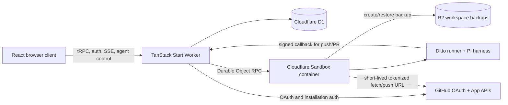

# System architecture

## Goal

Ditto is a web-based AI coding workspace for GitHub repositories. A user signs in
with GitHub, imports a repository, opens one or more isolated conversations, asks
an agent to inspect or change code, and exports the result as commits, a pushed
branch, and a pull request.

The product optimizes for an inspectable build loop rather than a general-purpose
browser IDE. The durable product record is in D1; the live repository and agent
processes run in a Cloudflare Sandbox; R2 backups make that workspace survive a
cold sandbox.

## System context



## Architectural units

| Unit | Primary paths | Responsibility |
|---|---|---|
| Product shell | `apps/web/src/routes`, `apps/web/src/components`, `apps/web/src/styles.css` | Dashboard, project/session navigation, chat timeline, settings, and Git workflow UI |
| Browser data layer | `apps/web/src/integrations/tanstack-query`, `apps/web/src/integrations/trpc/react.ts` | Query cache, SSR dehydration, typed tRPC options, and client mutations |
| Worker APIs | `apps/web/src/integrations/trpc`, `apps/web/src/routes/api.*` | Cookie-authenticated CRUD, workspace lifecycle, message history, SSE runs, and agent Git callbacks |
| Domain services | `apps/web/src/lib` | Agent lifecycle, sandbox persistence, worktrees, provider credentials/capabilities, Git export, secrets, message representation, and policy |
| Durable records | `apps/web/src/db`, `apps/web/migrations` | Users, OAuth state, projects, conversations, messages, sandbox handles, and backup generations |
| Sandbox runtime | `Dockerfile`, `packages/sandbox-runner` | Baked PI harness, isolated shell sessions, NDJSON protocol, and agent-only Git tools |
| Infrastructure | `alchemy.run.ts`, `apps/web/src/server.ts`, `apps/web/types/env.d.ts` | Cloudflare Worker, D1, R2, Sandbox Durable Object, bindings, and deployment (Alchemy sole deploy owner) |
| Engineering support | `plans`, `.agents`, `.claude`, `.cursor`, `.github` | Historical implementation intent, coding-agent guidance, hooks, and CI |

## Product hierarchy

```text
User
└── Project (GitHub repository + sandbox + encrypted environment variables)
    └── Workspace session (chat thread + session branch/worktree)
        ├── Messages (D1 user/assistant history)
        ├── PI session (sandbox JSONL model/tool history)
        └── Git export state (commit, push, pull request)
```

The word **session** is overloaded in dependencies, so use the qualified names
below:

| Name | Meaning |
|---|---|
| Auth session | better-auth login row and cookie |
| Workspace session | User-visible project conversation in D1 |
| Sandbox shell session | One isolated command environment created for an agent run |
| PI agent session | Resumable model/tool history in a JSONL file |

See [Agent harness architecture](agent-harness.md) for the identifiers and
runtime sequence connecting these layers.

## Primary product flows

### Import a project

1. `NewProjectDialog` loads repositories visible through the user's GitHub OAuth
   token and GitHub App installations.
2. `projects.create` reauthorizes the selected repository, encrypts project
   environment variables, and creates the D1 project row.
3. `bootstrapSandbox` creates or clears the project sandbox, clones with a
   short-lived installation token, scrubs the remote URL, installs dependencies,
   and creates the first R2 directory backup.
4. The project moves from `provisioning` to `ready`; failures move it to `failed`.

Projects created without a GitHub repository are accepted by the server but do
not have an agent-capable sandbox. The current UI creates GitHub-backed projects.

### Open a workspace

1. The project route queries project metadata and calls `workspace.ensureWorkspace`.
2. `ensureProjectSandbox` returns a connected sandbox, restores its R2 backup,
   or recreates it from GitHub.
3. The Worker returns active workspace sessions and the selected session.
4. The browser pages D1 messages newest-first, then reverses pages and rows for
   chronological display.

### Run the agent

1. `Composer` discovers model capabilities through `providerAuth.models`,
   clamps the persisted abstract thinking preference to the selected model,
   and posts the prompt, model, and optional effective level to
   `/api/agent/stream`.
2. The route authenticates the cookie and validates the JSON body. Then
   `prepareAgentRun` verifies the account's model authorization and any
   explicit thinking level before project/session/message side effects, creates
   or resolves the workspace session, and ensures its worktree.
3. `executeAgentRun` invokes the sandbox runner and emits `meta`,
   `control_ready`, ordered turn boundaries, `delta`, `agent`, `error`, and
   `done` SSE events.
4. While that stream is live, `/api/agent/control` can queue a PI follow-up or
   explicitly request Stop. Stop is session control; a browser disconnect is
   still detached from execution.
5. A queued follow-up is transient until PI starts it. At `turn_start`, the
   Worker inserts its complete user row and pending assistant row in D1; no D1
   rows are created for queued follow-ups dropped by Stop.
6. The browser builds an ordered assistant-parts timeline for each turn while
   retaining a bounded optimistic cache until D1 catches up.
7. Every started assistant is redacted and persisted as `complete` or `failed`;
   one versioned workspace backup follows the settled outer run best-effort.

### Export work

1. `sessionGit.gitStatus` derives a workflow state such as `commit`, `sync`,
   `push`, or `open-pr` from the session worktree and GitHub.
2. UI mutations and signed agent callbacks share the same `session-git` domain
   functions.
3. Mutations run in the session worktree under a per-session atomic lock.
4. Push preflight rejects secret-like paths and known secret content.
5. Network Git uses a newly minted GitHub App installation token and always
   scrubs `origin` back to its public URL.
6. Successful sandbox mutations trigger a best-effort versioned R2 backup.

### Session website preview

1. Authenticated `sessionPreview.start` acquires an external D1 lifecycle lease
   on the project row, rechecks ready/active ownership, and runs a fixed Vite,
   Next, or Astro binary in the session worktree on a leased port from
   `10000..10031`.
2. After TCP readiness (plus a short best-effort HTTP probe), the Worker calls
   Sandbox `exposePort()` and returns the ephemeral public URL only in that
   mutation response.
3. Production requests for `*.ayn.wtf` hit the Worker first; `proxyToSandbox()`
   serves active exposures, and unmatched preview hosts return 404 without
   falling through to the app.
4. `sessionPreview.stop`, session archive, and project delete confirm
   `unexposePort` plus exact process death under the same D1 lease before
   clearing the port or destroying the sandbox.

## State ownership

| State | Authority | Notes |
|---|---|---|
| Identity and OAuth account | D1 via better-auth | GitHub OAuth token is used to prove user-visible repository access |
| Project metadata and lifecycle | D1 `projects` | Includes sandbox ID, encrypted env vars, backup handle, and generations |
| Conversation metadata | D1 `workspace_sessions` | Includes branch, base commit, worktree path, title, archive status, and nullable preview port lease |
| Preview lifecycle lease | D1 `projects.previewLockToken` / `previewLockExpiresAt` / `deletingAt` | External fence across Start/Stop/archive/delete; not stored inside the sandbox |
| Chat history | D1 `messages` | Assistant rows have pending/complete/failed terminal lifecycle |
| Provider credentials and model catalogs | D1 `ai_provider_credentials` | Encrypted per-user credentials plus bounded safe catalogs and connection status |
| Repository files and Git refs | Sandbox `/workspace` | Primary clone plus `.ditto/worktrees/<sessionId>` |
| PI conversation state | Sandbox `/workspace/.ditto/sessions/*.jsonl` | Separate from UI chat persistence |
| User model and thinking preference | Browser local storage via Zustand (`ditto-user-preferences-v1`) | Convenience only; model syntax and canonical level are validated during rehydration; model capabilities are resolved server-side |
| Optimistic streamed messages | Browser module memory | Bounded and removed after server message IDs appear |
| Accepted follow-ups not yet started | PI agent session queue plus transient browser projection | Not durable; Stop drops queued items before D1 rows exist |
| Workspace durability | R2 directory backup | Excludes dependencies, builds, caches, and `.env*` |

## Dependency direction

The intended dependency flow is:

```text
routes/components
  -> tRPC routers or narrow browser libraries
  -> domain services in apps/web/src/lib
  -> DB, Cloudflare Sandbox, GitHub, Web Crypto

sandbox runner CLI
  -> PI harness
  -> NDJSON stdout
  -> Worker orchestration
```

Routes should stay thin. Cross-entry-point policy belongs in `apps/web/src/lib` so the UI
tRPC path and agent callback path cannot drift. Sandbox credentials are minted
by the Worker at the last responsible moment; the runner never receives a
GitHub installation token.

## Deliberate boundaries and limits

- A project has one Cloudflare sandbox ID; sessions isolate files with Git
  worktrees, not separate containers.
- Session worktrees share the primary clone's `node_modules` by symlink. They do
  not share `.env` files.
- Shell processes and ports are container-wide, so parallel sessions can still
  collide outside Git worktrees.
- Agent runs are intentionally not aborted when the browser disconnects. The
  server finishes persistence rather than leaving a pending assistant row.
- Thinking levels use Pi's canonical vocabulary. Missing capability metadata is a
  legacy compatibility signal: the client omits the optional level and Pi keeps
  its normal default rather than receiving a guessed provider-specific value.
- Explicit Stop is a separate authenticated session-control request. It clears
  queued PI follow-ups, requests cooperative PI abort, and lets terminal SSE
  persistence remain authoritative.
- R2 backups are snapshots, not a mounted filesystem. Cold wake always hydrates
  explicitly.
- Session deletion is archival. Archived sessions are excluded from active
  reads and cannot receive new messages.
- There is no merge operation in Ditto; pull requests are completed on GitHub.

## Where to read next

- [Frontend architecture](frontend.md) — routes, query state, chat, and UI composition.
- [Server and data architecture](server-and-data.md) — APIs, domain services, and schema.
- [Agent harness architecture](agent-harness.md) — sandbox execution, persistence, concurrency, and Git export.
- [Security and trust boundaries](security.md) — authentication, authorization, encryption, and egress controls.
- [Repository map](repository-map.md) — purpose of every file and generated artifact class.
