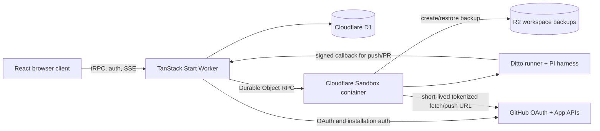

# System architecture

## Goal

Ditto is a web-based AI coding workspace for GitHub repositories. A user signs in
with GitHub, imports a repository, opens one or more isolated conversations, asks
an agent to inspect or change code, and exports the result as commits, a pushed
branch, and a pull request.

The product optimizes for an inspectable build loop rather than a general-purpose
browser IDE. The durable product record is in D1; the live repository and agent
processes run in a Cloudflare Sandbox; R2 backups make that workspace survive a
cold sandbox.

## System context



## Architectural units

| Unit | Primary paths | Responsibility |
|---|---|---|
| Product shell | `src/routes`, `src/components`, `src/styles.css` | Dashboard, project/session navigation, chat timeline, settings, and Git workflow UI |
| Browser data layer | `src/integrations/tanstack-query`, `src/integrations/trpc/react.ts` | Query cache, SSR dehydration, typed tRPC options, and client mutations |
| Worker APIs | `src/integrations/trpc`, `src/routes/api.*` | Cookie-authenticated CRUD, workspace lifecycle, message history, SSE runs, and agent Git callbacks |
| Domain services | `src/lib` | Agent lifecycle, sandbox persistence, worktrees, Git export, secrets, message representation, and policy |
| Durable records | `src/db`, `migrations` | Users, OAuth state, projects, conversations, messages, sandbox handles, and backup generations |
| Sandbox runtime | `Dockerfile`, `sandbox/runner` | Baked PI harness, isolated shell sessions, NDJSON protocol, and agent-only Git tools |
| Infrastructure | `alchemy.run.ts`, `src/server.ts`, `types/env.d.ts` | Cloudflare Worker, D1, R2, Sandbox Durable Object, bindings, and deployment |
| Engineering support | `plans`, `.agents`, `.claude`, `.cursor`, `.github` | Historical implementation intent, coding-agent guidance, hooks, and CI |

## Product hierarchy

```text
User
└── Project (GitHub repository + sandbox + encrypted environment variables)
    └── Workspace session (chat thread + session branch/worktree)
        ├── Messages (D1 user/assistant history)
        ├── PI session (sandbox JSONL model/tool history)
        └── Git export state (commit, push, pull request)
```

The word **session** is overloaded in dependencies, so use the qualified names
below:

| Name | Meaning |
|---|---|
| Auth session | better-auth login row and cookie |
| Workspace session | User-visible project conversation in D1 |
| Sandbox shell session | One isolated command environment created for an agent run |
| PI agent session | Resumable model/tool history in a JSONL file |

See [Agent harness architecture](agent-harness.md) for the identifiers and
runtime sequence connecting these layers.

## Primary product flows

### Import a project

1. `NewProjectDialog` loads repositories visible through the user's GitHub OAuth
   token and GitHub App installations.
2. `projects.create` reauthorizes the selected repository, encrypts project
   environment variables, and creates the D1 project row.
3. `bootstrapSandbox` creates or clears the project sandbox, clones with a
   short-lived installation token, scrubs the remote URL, installs dependencies,
   and creates the first R2 directory backup.
4. The project moves from `provisioning` to `ready`; failures move it to `failed`.

Projects created without a GitHub repository are accepted by the server but do
not have an agent-capable sandbox. The current UI creates GitHub-backed projects.

### Open a workspace

1. The project route queries project metadata and calls `workspace.ensureWorkspace`.
2. `ensureProjectSandbox` returns a connected sandbox, restores its R2 backup,
   or recreates it from GitHub.
3. The Worker returns active workspace sessions and the selected session.
4. The browser pages D1 messages newest-first, then reverses pages and rows for
   chronological display.

### Run the agent

1. `Composer` posts the prompt and model to `/api/agent/stream`.
2. `prepareAgentRun` verifies ownership and readiness, creates or resolves the
   workspace session, ensures its worktree, and atomically inserts user and
   pending assistant rows.
3. `executeAgentRun` invokes the sandbox runner and emits `meta`, `delta`,
   `agent`, `error`, and `done` SSE events.
4. The browser builds an ordered assistant-parts timeline from text and tool
   events while retaining a bounded optimistic cache until D1 catches up.
5. Terminal assistant content is redacted and persisted as `complete` or
   `failed`; a versioned workspace backup follows best-effort.

### Export work

1. `sessionGit.gitStatus` derives a workflow state such as `commit`, `sync`,
   `push`, or `open-pr` from the session worktree and GitHub.
2. UI mutations and signed agent callbacks share the same `session-git` domain
   functions.
3. Mutations run in the session worktree under a per-session atomic lock.
4. Push preflight rejects secret-like paths and known secret content.
5. Network Git uses a newly minted GitHub App installation token and always
   scrubs `origin` back to its public URL.
6. Successful sandbox mutations trigger a best-effort versioned R2 backup.

## State ownership

| State | Authority | Notes |
|---|---|---|
| Identity and OAuth account | D1 via better-auth | GitHub OAuth token is used to prove user-visible repository access |
| Project metadata and lifecycle | D1 `projects` | Includes sandbox ID, encrypted env vars, backup handle, and generations |
| Conversation metadata | D1 `workspace_sessions` | Includes branch, base commit, worktree path, title, and archive status |
| Chat history | D1 `messages` | Assistant rows have pending/complete/failed terminal lifecycle |
| Repository files and Git refs | Sandbox `/workspace` | Primary clone plus `.ditto/worktrees/<sessionId>` |
| PI conversation state | Sandbox `/workspace/.ditto/sessions/*.jsonl` | Separate from UI chat persistence |
| User model preference | Browser local storage via Zustand | Convenience only; validated during rehydration |
| Optimistic streamed messages | Browser module memory | Bounded and removed after server message IDs appear |
| Workspace durability | R2 directory backup | Excludes dependencies, builds, caches, and `.env*` |

## Dependency direction

The intended dependency flow is:

```text
routes/components
  -> tRPC routers or narrow browser libraries
  -> domain services in src/lib
  -> DB, Cloudflare Sandbox, GitHub, Web Crypto

sandbox runner CLI
  -> PI harness
  -> NDJSON stdout
  -> Worker orchestration
```

Routes should stay thin. Cross-entry-point policy belongs in `src/lib` so the UI
tRPC path and agent callback path cannot drift. Sandbox credentials are minted
by the Worker at the last responsible moment; the runner never receives a
GitHub installation token.

## Deliberate boundaries and limits

- A project has one Cloudflare sandbox ID; sessions isolate files with Git
  worktrees, not separate containers.
- Session worktrees share the primary clone's `node_modules` by symlink. They do
  not share `.env` files.
- Shell processes and ports are container-wide, so parallel sessions can still
  collide outside Git worktrees.
- Agent runs are intentionally not aborted when the browser disconnects. The
  server finishes persistence rather than leaving a pending assistant row.
- R2 backups are snapshots, not a mounted filesystem. Cold wake always hydrates
  explicitly.
- Session deletion is archival. Archived sessions are excluded from active
  reads and cannot receive new messages.
- There is no merge operation in Ditto; pull requests are completed on GitHub.

## Where to read next

- [Frontend architecture](frontend.md) — routes, query state, chat, and UI composition.
- [Server and data architecture](server-and-data.md) — APIs, domain services, and schema.
- [Agent harness architecture](agent-harness.md) — sandbox execution, persistence, concurrency, and Git export.
- [Security and trust boundaries](security.md) — authentication, authorization, encryption, and egress controls.
- [Repository map](repository-map.md) — purpose of every file and generated artifact class.
