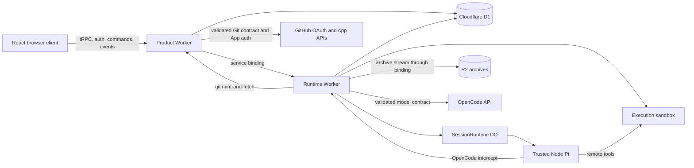

# System architecture

Status: target architecture. Implementation and validation pending. Requirements live in [trusted-session-runtime.md](../specs/trusted-session-runtime.md). Running code still uses the one-sandbox harness until cutover.

## Goal

Ditto is a web-based AI coding workspace for GitHub repositories. The product Worker authenticates, admits commands, and issues GitHub installation tokens. A separate runtime Worker owns both containers for a workspace session: a trusted session runtime that runs Pi, and an untrusted execution sandbox that holds the repository. D1 stores product records. Coordinator SQLite stores the execution journal. R2 stores immutable paired checkpoints.

## System context


```mermaid
flowchart LR
  Browser[React browser client]
  Product[Product Worker]
  Runtime[Runtime Worker]
  D1[(Cloudflare D1)]
  SessionRuntime[SessionRuntime DO]
  Brain[Trusted Node Pi]
  Sandbox[Execution sandbox]
  R2[(R2 archives)]
  GitHub[GitHub OAuth and App APIs]
  OpenCode[OpenCode API]

  Browser -->|tRPC, auth, commands, events| Product
  Product --> D1
  Runtime --> D1
  Product -->|service binding| Runtime
  Runtime -->|git mint-and-fetch| Product
  Runtime --> SessionRuntime
  SessionRuntime --> Brain
  Runtime --> Sandbox
  Brain -->|remote tools| Sandbox
  Brain -->|OpenCode intercept| Runtime
  Runtime -->|validated model contract| OpenCode
  Product -->|validated Git contract and App auth| GitHub
  Runtime -->|archive stream through binding| R2
```

## Product hierarchy

```text
User
└── Project (GitHub repository + encrypted environment values)
    ├── Immutable project seed
    └── Workspace session (conversation + branch + trusted brain + execution sandbox + recovery)
        ├── Messages and commands
        ├── Pi continuation
        └── Git export state
```

Projects do not own a live runtime. A temporary builder, an execution sandbox with no brain, creates the immutable seed and retires. A workspace session owns a trusted session runtime, a trusted brain identity, an execution sandbox identity, `/workspace`, independent capacity leases for brain and execution, and current/previous paired checkpoints.

## Main flows

### Import

`projects.create` reauthorizes the repository and calls `ProjectSeed`. The product Worker records the project, seed, and builder identity, then asks the runtime service to run the builder. The builder attaches the outbound broker, fetches the owned default branch without a token in the sandbox, streams a source-only archive through the runtime R2 binding, then retires permanently.

### Open and run

D1 history loads independently of runtime state. Opening history must not start either container.

The browser submits a prompt and optional `off`, `high`, or `max` thinking level to the product command interface. The product Worker authenticates, checks ownership, asks the runtime service whether the OpenCode key is configured, and atomically stores the command, user message, pending assistant, and delivery intent. It returns a receipt. It does not wait for the run.

The runtime coordinator consumes the command, reserves capacity, opens privileged-operation windows only when it admits execution, and starts or notifies Pi in the trusted Node container. Pi uses a public placeholder. The runtime Worker validates each OpenCode request and adds the real key on a reconstructed upstream request. Repository tools run in the execution sandbox. Git smart-HTTP is validated in the runtime Worker, then minted and fetched by the product Worker.

### Recovery

Each completed agent run or successful local Git mutation reserves a session mutation generation. The coordinator publishes a paired checkpoint: workspace archive plus Pi continuation. Current and previous pairs remain available. Restore tries current, then previous, and never falls back silently to the project seed.

R2 object keys stay inside archive code and D1. Archive bytes stream through the runtime Worker binding. Neither container receives R2 credentials, signed URLs, object keys, or bucket mounts.

### Git

Project-seed fetch and workspace sync use exact smart-HTTP contracts. The product Worker mints installation tokens only after identity and request validation, attaches them itself, and fetches GitHub. The token never enters the runtime Worker. Product push remains disabled until a crafted non-fast-forward receive-pack is proved rejected. Pull-request creation stays product-Worker-owned through Octokit.

### Preview and lifecycle

Each execution sandbox uses fixed port `10000` and one stable exposure capability while active. The preview host hits the product Worker, which checks revocation and service-binds to the runtime Worker. Live preview can defer a pending checkpoint for at most ten minutes. At that deadline, an in-flight arbitrary shell becomes unknown and blocks review; a read or structured write may finish first. The deadline must not snapshot a filesystem that merely looks idle.

D1 capacity leases enforce two pools: 20 global execution containers and 20 global trusted brains, two of each per user, with 15-minute queue expiry. Sleeping runtimes release capacity. Each container sleeps after ten idle minutes.

Archive checkpoints final pending work, revokes preview, retires both identities, destroys both runtimes, and retains recovery. Project deletion marks the project `deleting`, retires identity authority including the trusted brain, closes operations, cancels work, revokes previews, destroys runtimes, records archive cleanup, then removes product rows. Permanent identity tombstones survive.

## Trust and dependency direction

```text
routes and components
  -> tRPC routers or narrow browser clients
  -> product Worker domain modules
  -> runtime Worker service
  -> SessionRuntime and Sandbox
  -> D1, R2, GitHub, OpenCode
```

Everything in either container is untrusted for credentials. The trusted brain is trusted relative to repository code and still must not receive platform keys. Routes do not mint credentials or construct raw container clients. New runtime uses go through the command boundary. Privileged egress goes through identity authority and the egress broker.

## Current limits

- One fixed model and three thinking levels.
- Product push is disabled pending the non-fast-forward integration gate.
- Project environment values are visible to authorized execution commands and may leave through credential-free public internet access.
- Preview-created filesystem changes are disposable.
- Production two-container behavior remains unvalidated until paid-plan tests run.
- A failed two-container gate stops cutover. It does not put Pi back in the execution sandbox or into workerd.
