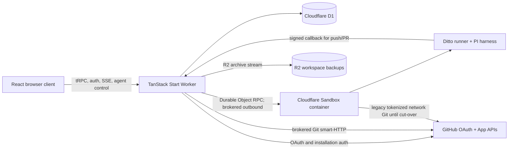

# System architecture

## Goal

Ditto is a web-based AI coding workspace for GitHub repositories. A user signs in
with GitHub, imports a repository, opens conversation-specific Git worktrees,
asks an agent to inspect or change code, and exports the result as commits, a
pushed branch, and a pull request.

The product optimizes for an inspectable build loop rather than a general-purpose
browser IDE. The durable product record is in D1; the live repository and agent
processes run in a Cloudflare Sandbox; R2 backups make that workspace survive a
cold sandbox.

## System context


```mermaid
flowchart LR
  Browser[React browser client]
  Worker[TanStack Start Worker]
  D1[(Cloudflare D1)]
  Sandbox[Cloudflare Sandbox container]
  Runner[Ditto runner + PI harness]
  R2[(R2 workspace backups)]
  GitHub[GitHub OAuth + App APIs]

  Browser -->|tRPC, auth, SSE, agent control| Worker
  Worker --> D1
  Worker -->|Durable Object RPC; brokered outbound| Sandbox
  Sandbox --> Runner
  Worker -->|R2 archive stream| R2
  Worker -->|OAuth and installation auth| GitHub
  Worker -->|brokered Git smart-HTTP| GitHub
  Sandbox -->|legacy tokenized network Git until cut-over| GitHub
  Runner -->|signed callback for push/PR| Worker
```

## Architectural units

| Unit | Primary paths | Responsibility |
|---|---|---|
| Product shell | `apps/web/src/routes`, `apps/web/src/components`, `apps/web/src/styles.css` | Dashboard, project/session navigation, chat timeline, and Git workflow UI |
| Browser data layer | `apps/web/src/integrations/tanstack-query`, `apps/web/src/integrations/trpc/react.ts` | Query cache, SSR dehydration, typed tRPC options, and client mutations |
| Worker APIs | `apps/web/src/integrations/trpc`, `apps/web/src/routes/api.*` | Cookie-authenticated CRUD, workspace lifecycle, message history, SSE runs, and agent Git callbacks |
| Domain services | `apps/web/src/lib` | Agent lifecycle, sandbox persistence, worktrees, Git export, secrets, message representation, and policy |
| Durable records | `apps/web/src/db`, `apps/web/migrations` | Users, OAuth state, projects, conversations, messages, sandbox handles, and backup generations |
| Sandbox runtime | `Dockerfile`, `packages/sandbox-runner` | Baked PI harness, isolated shell sessions, NDJSON protocol, and agent-only Git tools |
| Infrastructure | `alchemy.run.ts`, `apps/web/src/server.ts`, `apps/web/types/env.d.ts` | Cloudflare Worker, D1, R2, Sandbox Durable Object, bindings, and deployment (Alchemy sole deploy owner) |
| Engineering support | `AGENTS.md`, `docs/development` | Coding-agent guidance and the optional human workflow |

## Product hierarchy

```text
User
└── Project (GitHub repository + encrypted environment variables)
    ├── Project seed (immutable archive; new imports)
    ├── Project sandbox (legacy shared runtime until cut-over)
    └── Workspace session (chat thread + session branch/worktree)
        ├── Messages (D1 user/assistant history)
        ├── PI session (sandbox JSONL model/tool history)
        └── Git export state (commit, push, pull request)
```

The word **session** is overloaded in dependencies, so use the qualified names
below:

| Name | Meaning |
|---|---|
| Auth session | better-auth login row and cookie |
| Workspace session | User-visible project conversation in D1 |
| Sandbox shell session | One isolated command environment created for an agent run |
| PI agent session | Resumable model/tool history in a JSONL file |

See [Agent harness architecture](agent-harness.md) for the identifiers and
runtime sequence connecting these layers.

## Primary product flows

### Import a project

1. `NewProjectDialog` loads repositories visible through the user's GitHub OAuth
   token and GitHub App installations.
2. `projects.create` reauthorizes the selected repository and encrypts project
   environment variables.
3. `buildProjectSeed` creates the project, pending seed, sandbox identity, and
   Git fetch operation in one D1 batch, then runs a temporary builder. The
   builder fetches the owned default branch through the Worker Git broker
   (installation token stays in the Worker), stores a source-only seed archive
   in R2, and is destroyed and permanently retired. Dependency-inclusive seeds
   wait on benchmarks that are not yet in-tree, so imports are source-only.
4. The project moves from `provisioning` to `ready` only after seed metadata is
   durable; failures move it to `failed`. New imports do not store
   `projects.sandboxId`.

Projects created without a GitHub repository are accepted by the server but do
not have an agent-capable sandbox. The current UI creates GitHub-backed projects.
Legacy projects that still own a project sandbox continue to restore through
`bootstrapSandbox` / `project-sandbox` until that path is removed.

### Open a workspace

1. The project route loads owned project metadata and, for an explicit session
   URL, pages D1 chat history independently of sandbox readiness.
2. When D1 marks the project `ready`, the route runs `workspace.checkSandbox`
   (observation only). If the check returns `needs_restore`, the route calls
   `workspace.provisionSandbox` once under the existing
   `ready -> provisioning` fence. Warm visits that are already `connected` stay
   silent — no provision call and no toast.
3. The Worker returns active workspace sessions, the selected session, and a
   sandbox state (`connected`, `needs_restore`, restore/recreate success,
   `provisioning`, or `failed`). `needs_restore` is runtime-only and is never
   written to D1.
4. History stays readable while check/provision runs. Sandbox-backed actions
   stay disabled until the runtime is proven ready. A loading toast appears only
   when this tab starts real provision work.

### Run the agent

1. `Composer` clamps the persisted thinking preference to `off`, `high`, or
   `max` and posts the prompt plus optional effective level to
   `/api/agent/stream`. The browser does not send a model field.
2. The route authenticates the cookie and validates the JSON body. Then
   `prepareAgentRun` checks `OPENCODE_API_KEY` and any explicit thinking level
   before project/session/message side effects, creates or resolves the
   workspace session, and ensures its worktree. The Worker always uses
   `opencode/deepseek-v4-flash-free`.
3. `executeAgentRun` invokes the sandbox runner and emits `meta`,
   `control_ready`, ordered turn boundaries, `delta`, `agent`, `error`, and
   `done` SSE events.
4. While that stream is live, `/api/agent/control` can queue a PI follow-up or
   explicitly request Stop. Stop is session control; a browser disconnect is
   still detached from execution.
5. A queued follow-up is transient until PI starts it. At `turn_start`, the
   Worker inserts its complete user row and pending assistant row in D1; no D1
   rows are created for queued follow-ups dropped by Stop.
6. The browser builds an ordered assistant-parts timeline for each turn while
   retaining a bounded optimistic cache until D1 catches up.
7. Every started assistant is redacted and persisted as `complete` or `failed`;
   one versioned workspace backup follows the settled outer run best-effort.

### Export work

1. `sessionGit.gitStatus` derives a workflow state such as `commit`, `sync`,
   `push`, or `open-pr` from the session worktree and GitHub.
2. UI mutations and signed agent callbacks share the same `session-git` domain
   functions.
3. Mutations run in the session worktree under a per-session atomic lock.
4. Push preflight rejects secret-like paths and known secret content before any
   token is minted; the exact preflight `headRev` is what gets pushed.
5. Credential-bearing fetch/push runs from a fresh temporary bare repository
   with a public GitHub URL and command-scoped env auth; objects transfer by
   exact SHA without credentials. Remote scrubbing remains defense in depth.
   Initial SDK clone still uses a tokenized URL as the documented exception.
6. Successful sandbox mutations trigger a best-effort versioned R2 backup.

### Session website preview

1. Authenticated `sessionPreview.start` acquires an external D1 lifecycle lease
   on the project row, rechecks ready/active ownership, and runs a fixed Vite,
   Next, or Astro binary in the session worktree on a leased port from
   `10000..10031`.
2. After TCP readiness (plus a short best-effort HTTP probe), the Worker calls
   Sandbox `exposePort()` and returns the ephemeral public URL only in that
   mutation response.
3. Production requests for `*.ayn.wtf` hit the Worker first; `proxyToSandbox()`
   serves active exposures, and unmatched preview hosts return 404 without
   falling through to the app.
4. `sessionPreview.stop`, session archive, and project delete confirm
   `unexposePort` plus exact process death under the same D1 lease before
   clearing the port or destroying the sandbox.

## State ownership

| State | Authority | Notes |
|---|---|---|
| Identity and OAuth account | D1 via better-auth | GitHub OAuth token is used to prove user-visible repository access |
| Project metadata and lifecycle | D1 `projects` | Includes sandbox ID, encrypted env vars, backup handle, and generations |
| Conversation metadata | D1 `workspace_sessions` | Includes branch, base commit, worktree path, title, archive status, and nullable preview port lease |
| Preview lifecycle lease | D1 `projects.previewLockToken` / `previewLockExpiresAt` / `deletingAt` | External fence across Start/Stop/archive/delete; not stored inside the sandbox |
| Chat history | D1 `messages` | Assistant rows have pending/complete/failed terminal lifecycle |
| Leftover provider credential rows | D1 `ai_provider_credentials` / `provider_auth_attempts` | Not a current product path; pending removal |
| Repository files and Git refs | Sandbox `/workspace` | Primary clone plus `.ditto/worktrees/<sessionId>` |
| PI conversation state | Sandbox `/workspace/.ditto/sessions/*.jsonl` | Separate from UI chat persistence |
| User thinking preference | Browser local storage via Zustand (`ditto-user-preferences-v1`) | Convenience only; unsupported persisted levels are clamped to `off`, `high`, or `max` |
| Optimistic streamed messages | Browser module memory | Bounded and removed after server message IDs appear |
| Accepted follow-ups not yet started | PI agent session queue plus transient browser projection | Not durable; Stop drops queued items before D1 rows exist |
| Workspace durability | R2 directory backup | Excludes dependencies, builds, caches, and `.env*` |

## Dependency direction

The intended dependency flow is:

```text
routes/components
  -> tRPC routers or narrow browser libraries
  -> domain services in apps/web/src/lib
  -> DB, Cloudflare Sandbox, GitHub, Web Crypto

sandbox runner CLI
  -> PI harness
  -> NDJSON stdout
  -> Worker orchestration
```

Routes should stay thin. Cross-entry-point policy belongs in `apps/web/src/lib` so the UI
tRPC path and agent callback path cannot drift. Sandbox credentials are minted
by the Worker at the last responsible moment; the runner never receives a
GitHub installation token.

## Deliberate boundaries and limits

- New GitHub imports own an immutable project seed and no persistent sandbox.
  Legacy projects may still own one shared Cloudflare sandbox ID with Git
  worktree isolation until that path is removed.
- Session worktrees share the primary clone's `node_modules` by symlink. They do
  not share `.env` files.
- Shell processes and ports are container-wide, so parallel sessions can still
  collide outside Git worktrees on the legacy shared sandbox.
- Agent runs are intentionally not aborted when the browser disconnects. The
  server finishes persistence rather than leaving a pending assistant row.
- Thinking levels use Pi's canonical vocabulary. Missing capability metadata is a
  legacy compatibility signal: the client omits the optional level and Pi keeps
  its normal default rather than receiving a guessed provider-specific value.
- Explicit Stop is a separate authenticated session-control request. It clears
  queued PI follow-ups, requests cooperative PI abort, and lets terminal SSE
  persistence remain authoritative.
- R2 archives are Worker-streamed snapshots, not a mounted filesystem. Cold wake
  always hydrates explicitly.
- Session deletion is archival. Archived sessions are excluded from active
  reads and cannot receive new messages.
- There is no merge operation in Ditto; pull requests are completed on GitHub.
- New project-seed builders fetch Git through the Worker broker; the
  installation token stays in the Worker. Legacy session sync and agent Git
  still inject short-lived tokens into sandbox network Git processes.
- Provider credentials and the agent Git callback JWT still enter legacy
  project-sandbox agent runs.
- Normal chat runs still use PI's default project resource discovery.
- Builders attach `dittoCatchAll` via `setOutboundHandler` and are brokered;
  legacy project sandboxes never set the handler and keep direct internet until
  later plans. The shared subclass does not set `enableInternet = false`.

See [platform credential broker](../specs/platform-credential-broker.md) for the
remaining cut-over (per-session sandboxes, model broker, legacy column removal).

## Where to read next

- [Frontend architecture](frontend.md) — routes, query state, chat, and UI composition.
- [Server and data architecture](server-and-data.md) — APIs, domain services, and schema.
- [Agent harness architecture](agent-harness.md) — sandbox execution, persistence, concurrency, and Git export.
- [Security and trust boundaries](security.md) — authentication, authorization, encryption, and egress controls.
- [Repository map](repository-map.md) — purpose of every file and generated artifact class.
