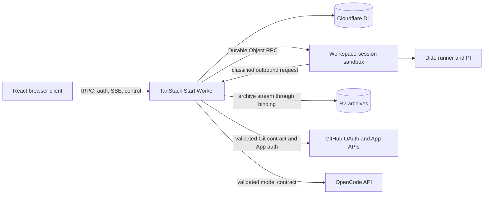

# System architecture

## Goal

Ditto is a web-based AI coding workspace for GitHub repositories. The Worker owns authentication, policy, credentials, and durable state. Each workspace session runs in its own untrusted Cloudflare Sandbox. D1 stores product and runtime authority, while Worker-streamed R2 archives provide seeds and recovery.

## System context


```mermaid
flowchart LR
  Browser[React browser client]
  Worker[TanStack Start Worker]
  D1[(Cloudflare D1)]
  Sandbox[Workspace-session sandbox]
  Runner[Ditto runner and PI]
  R2[(R2 archives)]
  GitHub[GitHub OAuth and App APIs]
  OpenCode[OpenCode API]

  Browser -->|tRPC, auth, SSE, control| Worker
  Worker --> D1
  Worker -->|Durable Object RPC| Sandbox
  Sandbox --> Runner
  Sandbox -->|classified outbound request| Worker
  Worker -->|validated model contract| OpenCode
  Worker -->|validated Git contract and App auth| GitHub
  Worker -->|archive stream through binding| R2
```

## Product hierarchy

```text
User
└── Project (GitHub repository + encrypted environment values)
    ├── Immutable project seed
    └── Workspace session (conversation + branch + isolated runtime + recovery)
        ├── Messages
        ├── PI history
        └── Git export state
```

Projects do not own a sandbox or mutable backup. A temporary builder creates the immutable seed and retires. A workspace session owns one random sandbox identity, `/workspace` checkout, lifecycle generation, capacity lease, and current/previous recovery archives.

## Main flows

### Import

`projects.create` reauthorizes the repository and calls `ProjectSeed`. The module records the project, seed, builder identity, and Git-fetch operation before sandbox work. The builder attaches the outbound broker, fetches the owned default branch without a token in the sandbox, creates a source-only archive through the R2 binding, then retires permanently.

### Open and run

D1 history loads independently of runtime state. Runtime observation does not wake the container. First demand opens `WorkspaceRuntime`, acquires durable capacity, creates or restores the session sandbox, attaches the outbound handler, and returns a lease. Agent commands alone receive decrypted project environment values.

The browser sends a prompt and optional `off`, `high`, or `max` thinking level. The Worker always selects `opencode/deepseek-v4-flash-free`. PI uses a public placeholder. The Worker validates each OpenCode request against current D1 identity and operation authority before adding the real key upstream.

### Recovery

Each completed agent run or successful local Git mutation reserves a session mutation generation. `WorkspaceRecovery` checkpoints under an exclusive runtime lease. Current and previous generations remain available. Restore tries current, then previous, and never falls back silently to the project seed.

R2 object keys stay inside `sandbox-archive.ts` and D1. Archive bytes stream through RPC and the Worker binding. Sandboxes receive no R2 credentials, signed URLs, object keys, or bucket mounts.

### Git

Project-seed fetch and workspace sync use exact smart-HTTP contracts. The Worker mints installation tokens only after identity and request validation. Product push remains disabled until a crafted non-fast-forward receive-pack is proved rejected. Pull-request creation stays Worker-owned through Octokit.

### Preview and lifecycle

Each workspace-session sandbox uses fixed port `10000` and one stable exposure capability while active. Preview traffic observation stays in the Sandbox Durable Object. Live preview can defer a pending checkpoint for at most ten minutes. Stop checkpoints pending work before completion.

D1 runtime work and capacity leases enforce FIFO queueing, 20 global running slots, two per user, and 15-minute queue expiry. Sleeping runtimes release capacity. The Sandbox class sleeps after ten idle minutes.

Archive checkpoints final pending work, revokes preview, retires the identity, destroys the runtime, and retains recovery. Project deletion marks the project `deleting`, retires identity authority, closes operations, cancels work, revokes previews, destroys runtimes, records archive cleanup, then removes product rows. Permanent identity tombstones survive.

## Trust and dependency direction

```text
routes and components
  -> tRPC routers or narrow browser clients
  -> apps/web/src/lib domain modules
  -> D1, Sandbox RPC, R2 bindings, GitHub, OpenCode

sandbox runner
  -> PI harness
  -> versioned NDJSON
  -> Worker orchestration
```

Everything in a sandbox is untrusted. Routes do not mint credentials or construct raw sandbox clients. New runtime uses go through `WorkspaceRuntime`; privileged egress goes through `SandboxAuthority` and `SandboxEgressBroker`.

## Current limits

- One fixed model and three thinking levels.
- Product push is disabled pending the non-fast-forward integration gate.
- Project environment values are visible to the agent command and may leave through credential-free public internet access.
- Preview-created filesystem changes are disposable.
- Production Sandbox behavior remains unvalidated until paid-plan tests run.
