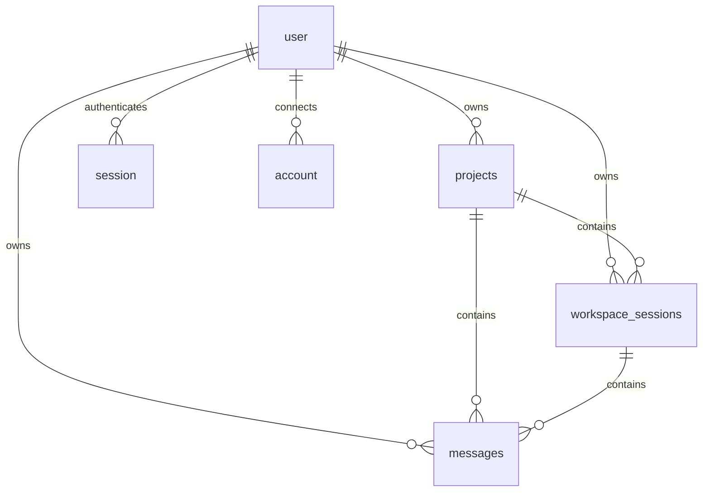

# Server and data architecture

## Goal

The Cloudflare Worker is the control plane. It authenticates requests, enforces
ownership, stores durable product state, coordinates sandbox work, and is the
only process allowed to mint GitHub installation credentials.

## Entry points

`apps/web/src/server.ts` exports the TanStack Start fetch handler and the Cloudflare
Sandbox Durable Object class. TanStack Start routes provide four server-facing
surfaces:

| Surface | Authentication | Use |
|---|---|---|
| `/api/auth/$` | better-auth protocol | GitHub OAuth and auth sessions |
| `/api/trpc/$` | Cookie session in tRPC context | Browser queries and mutations |
| `/api/agent/stream` | Cookie session checked directly | Long-lived SSE agent run |
| `/api/agent/control` | Cookie session checked directly | Follow-up or Stop for one active PI agent session |
| `/api/agent/git` | Short-lived scoped HS256 JWT | Push/PR actions invoked by PI tools |

The agent routes bypass tRPC because they stream SSE, control a live run, or
serve a machine callback. Their business logic still delegates to `apps/web/src/lib`
services.

## tRPC control plane

`apps/web/src/integrations/trpc/init.ts` creates context from the request, Cloudflare
bindings, and better-auth session. `protectedProcedure` rejects anonymous calls
and narrows context to an authenticated user.

| Router | Operations | Delegated services |
|---|---|---|
| `health` | Liveness query | none |
| `github` | Import state and branch listing | GitHub OAuth visibility, installation Octokit |
| `projects` | Create, list, get, rename, delete, env-var management | Authorization, encryption, bootstrap/restore |
| `workspace` | Ensure/retry workspace, page messages, archive session | Sandbox lifecycle, cursor codec, session ownership |
| `sessionGit` | Status, sync, commit, push, open PR | Worktree, Git state machine, secret policy, backup |

All project/session reads constrain both resource IDs and `userId`. Repository
operations additionally prove that the signed-in user's GitHub account can see
the selected repository through the stated App installation.

## Domain service boundaries

The large workflows live in narrow modules rather than route handlers:

- `agent-run-service.ts` is the transaction-like agent lifecycle: prepare,
  multi-turn stream persistence, terminal settlement, and backup.
- `agent-control-service.ts` authenticates run-scoped follow-up/Stop ownership,
  writes the bounded control job, invokes the baked control CLI, and maps stale
  targets without acquiring the active workspace-session lock.
- `agent-run.ts` owns the Sandbox shell session, job file, runner process,
  protocol parsing, redaction, and cleanup.
- `project-sandbox.ts` owns project readiness, cold restore/recreate, and
  versioned backup metadata.
- `sandbox-bootstrap.ts` owns low-level Sandbox SDK, clone/fetch/install,
  runner-health, backup, restore, and command error handling.
- `workspace-session.ts`, `session-worktree.ts`, and
  `session-workspace-lock.ts` own conversation lifecycle and write isolation.
- `session-git.ts` is the shared Git/GitHub state machine used by browser and
  agent export paths.
- `session-git-metadata.ts` collects bounded Git snapshots and bridges the
  one-shot `ditto-git-metadata` runner (operator-fallback credential only).
- `session-git-ui-actions.ts` orchestrates UI Commit/Open PR under one session
  lock (snapshot → generate → mutate → release → conditional backup).
- `agent-git-handler.ts` resolves JWT claims back to current D1 state and
  dispatches to the same Git services.
- `github-export.ts` owns deterministic branch/PR text helpers and safe
  command/error formatting for non-UI/agent-callback callers.
- `git-secret-policy.ts` is a fail-closed preflight over outgoing commit paths
  and added content.
- Runner boundary: chat uses `ditto-runner` + durable PI JSONL; UI metadata uses
  `ditto-git-metadata` + in-memory PI with a closed job/result protocol and no
  chat/D1 persistence.

Dependency injection in complex services exists for deterministic tests, not as
an alternate runtime plugin system.

## Data model

`apps/web/src/db/schema.ts` is the current schema authority. `apps/web/migrations` is the ordered
D1 evolution history generated by Drizzle.

### Product tables

| Table | Purpose | Important invariants |
|---|---|---|
| `projects` | User-owned GitHub project and sandbox lifecycle | Status is provisioning/ready/failed; env vars and backup handle never return in normal project responses |
| `workspace_sessions` | User-visible conversation and its Git worktree | Status is active/archived; branch/base/path bind chat to filesystem isolation |
| `messages` | User and assistant chat records | Assistant status is pending until terminal complete/failed; project/session/user IDs are all stored |

### Authentication tables

| Table | Purpose |
|---|---|
| `user` | better-auth identity |
| `session` | Login sessions and expiry |
| `account` | OAuth provider account and tokens |
| `verification` | better-auth verification state |

`todos` is retained starter/demo schema and is not part of the current product
flow.

### Relationships



Foreign keys cascade from users/projects/sessions. Ownership is still checked in
queries rather than relying only on referential integrity.

## Lifecycle state machines

### Project

```text
create import -> provisioning -> ready
                         \-----> failed
failed -- retry restore --------> ready | failed
ready -- cold wake -------------> provisioning -> ready | failed
```

A restore acquires a D1 status transition from `ready` to `provisioning`, which
prevents two Workers from restoring the same project concurrently.

### Workspace session

```text
(no explicit ID) -> active -> archived
(explicit active ID) -> active
(explicit missing/archived/foreign ID) -> not found
```

An explicit invalid ID never silently creates a replacement conversation.

### Assistant message

```text
pending -> complete
pending -> failed
```

The initial user row and pending assistant row are inserted together only after
the session worktree is ready. A queued follow-up remains transient until PI
starts it; then its complete user row and pending assistant row are inserted
together. Every started assistant reaches `complete` or `failed` before its turn
or the outer run settles. Follow-ups cleared before start never create rows.

### Git workflow

`getSessionGitStatus` combines dirty state, ahead/behind counts, remote branch,
default branch, and existing pull request into one discriminated workflow. UI
buttons and callback operations gate against that workflow instead of
reconstructing policy separately.

## Message pagination

Messages use keyset pagination with `(createdAt, SQLite rowid)` because timestamps
can collide. The cursor is encoded and validated by `message-cursor.ts`.
Queries fetch `limit + 1` rows in descending order, produce an older-page cursor,
then reverse each page for chronological rendering. The client reverses page
order when flattening an infinite query.

## Workspace durability

A project row stores the serialized R2 directory-backup handle. Backups exclude
dependencies, caches, builds, and `.env*`; dependencies are reinstalled after
restore. Post-run and post-Git writes reserve monotonically increasing candidate
generations so an older, slower backup cannot replace newer metadata.

The sandbox filesystem is the live source for repository state. D1 stores the
pointer and lifecycle metadata; R2 stores recoverable snapshots. Neither D1 nor
R2 is treated as a live mounted repository.

## Infrastructure and configuration

Root `alchemy.run.ts` is the sole deployment owner. It defines one TanStack Start
Worker (cwd `apps/web`) with:

- a D1 database migrated from `apps/web/migrations`;
- an R2 bucket for sandbox backups;
- a Cloudflare Sandbox container binding using RPC transport; and
- secrets/config bindings for auth, GitHub, R2, and the model provider.

There is no SST or Wrangler-as-deploy boundary; Alchemy owns `dev`, `deploy`, and
`destroy`. Local generated config is written under `apps/web/.alchemy/local/`.

The root `Dockerfile` extends the Cloudflare sandbox image and builds the
independent npm package under `packages/sandbox-runner` into `/opt/ditto-runner`.
`apps/web/vite.config.ts` composes TanStack Start, React Compiler, Tailwind,
devtools, and Alchemy only when the local generated Wrangler configuration is
available (`envDir` points at the monorepo root).

## Tests

Tests are colocated as `*.test.ts`/`*.test.tsx`. Domain tests favor injected
Sandbox, D1, clock, and callback doubles. The largest suites cover full state
transitions in agent orchestration, sandbox bootstrap/restore, Git export,
redaction, JWT validation, worktree behavior, message compatibility, and tRPC
ownership. `pnpm verify` is the root quality gate and also runs the independent
runner package verification.

## Account provider credentials (Plan 025)

- Credentials are account-scoped in D1 (`ai_provider_credentials`), encrypted with `AI_CREDENTIALS_ENCRYPTION_KEY` + user/provider AAD.
- Login/refresh runs in auth-only sandboxes under `/tmp`; no `auth.json`, no project env, no R2 backup of secrets.
- Project runners receive `DITTO_PI_CREDENTIAL` (runtime projection only; OAuth refresh stripped) and delete it before session/tools.
- Fallback model is exactly `opencode/deepseek-v4-flash-free` via operator `OPENCODE_API_KEY`.
- Account Settings UI connects providers; composer lists fallback + connected models.
