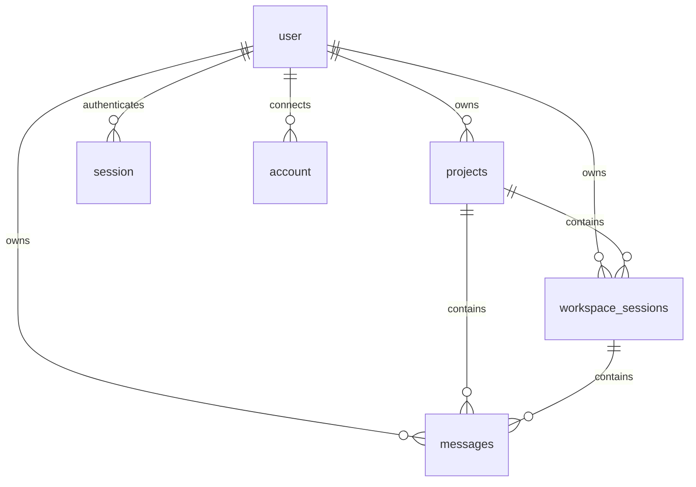

# Server and data architecture

## Goal

The Cloudflare Worker is the control plane. It authenticates requests, enforces
ownership, stores durable product state, coordinates sandbox work, and is the
only process allowed to mint GitHub installation credentials.

## Entry points

`apps/web/src/server.ts` exports a Ditto `Sandbox` subclass (HTTPS intercept on;
internet left enabled for legacy instances) with a catch-all outbound handler
registry, re-exports `ContainerProxy`, and calls `proxyToSandbox(request, env)`
before the TanStack Start fetch handler. Builders and new workspace-session
sandboxes call `setOutboundHandler("dittoCatchAll", …)`; legacy project
sandboxes keep direct internet until later plans. Unmatched production hosts under `*.ayn.wtf` return plain
404 and never fall through to the app. Local Vite (`vite.config.ts`) skips its
transform/static middleware for session preview hosts
(`<port>-<sandbox>-<token>.localhost`) so those requests reach the Worker and
`proxyToSandbox` instead of the parent app's `/node_modules/.vite` optimizer.
TanStack Start routes provide five server-facing surfaces:

| Surface | Authentication | Use |
|---|---|---|
| `/api/auth/$` | better-auth protocol | GitHub OAuth and auth sessions |
| `/api/trpc/$` | Cookie session in tRPC context | Browser queries and mutations |
| `/api/agent/stream` | Cookie session checked directly | Long-lived SSE agent run |
| `/api/agent/control` | Cookie session checked directly | Follow-up or Stop for one active PI agent session |
| `/api/agent/git` | Short-lived scoped HS256 JWT | Push/PR actions invoked by PI tools |

The agent routes bypass tRPC when they stream events, control a live process, or
serve a machine callback. Their business logic still delegates to
`apps/web/src/lib` services.

## tRPC control plane

`apps/web/src/integrations/trpc/init.ts` creates context from the request, Cloudflare
bindings, and better-auth session. `protectedProcedure` rejects anonymous calls
and narrows context to an authenticated user.

| Router | Operations | Delegated services |
|---|---|---|
| `health` | Liveness query | none |
| `github` | Import state and branch listing | GitHub OAuth visibility, installation Octokit |
| `projects` | Create, list, get, rename, delete, env-var management | Authorization, encryption, project-seed build / legacy restore |
| `workspace` | Check/provision/retry sandbox, page messages, archive session | Sandbox lifecycle, cursor codec, session ownership, preview cleanup on archive |
| `sessionGit` | Status, sync, commit, push, open PR | Worktree, Git state machine, secret policy, backup |
| `sessionPreview` | Start/stop session website preview | D1 lifecycle lease, port allocation, fixed Vite/Next/Astro process, `exposePort` |

All project/session reads constrain both resource IDs and `userId`. Repository
operations additionally prove that the signed-in user's GitHub account can see
the selected repository through the stated App installation.

## Domain service boundaries

The large workflows live in narrow modules rather than route handlers:

- `agent-run-service.ts` is the transaction-like agent lifecycle: prepare,
  multi-turn stream persistence, terminal settlement, and backup. It validates
  `OPENCODE_API_KEY` and any explicit thinking level (`off`, `high`, `max`)
  before project/session/message side effects, then uses the operator fallback
  credential for the fixed model.
- `agent-control-service.ts` authenticates run-scoped follow-up/Stop ownership,
  writes the bounded control job, invokes the baked control CLI, and maps stale
  targets without acquiring the active workspace-session lock.
- `agent-run.ts` owns the Sandbox shell session, job file, runner process,
  protocol parsing, redaction, and cleanup.
- `project-sandbox.ts` owns observation (`checkProjectSandbox`), cold
  restore/recreate (`provisionProjectSandbox`), and versioned backup metadata.
  `needs_restore` is a runtime-only API state and is never written to D1.
- `sandbox-archive.ts` owns token-free archive create/restore/delete. It is the
  only module that knows R2 object keys. Callers receive opaque archive IDs.
- `sandbox-authority.ts` owns sandbox identity registration, generation
  rotation, permanent retirement, and privileged operation open/close/resolve.
- `sandbox-egress-broker.ts` owns outbound classification, authority lookup,
  Git fetch forwarding, and credential-free public internet policy.
- `project-seed.ts` owns temporary builder provisioning for new GitHub imports.
- `sandbox-bootstrap.ts` owns low-level Sandbox SDK helpers and the legacy
  project-sandbox clone/fetch/install and archive-backed backup/restore path.
- `workspace-session.ts`, `workspace-runtime.ts`, `session-worktree.ts` (legacy), and
  `session-workspace-lock.ts` own conversation lifecycle and write isolation.
- `session-preview.ts` owns the external D1 project lifecycle lease, per-session
  preview port allocation (`10000..10031`), fixed binary discovery/start, URL
  validation, and stop/archive/delete cleanup ordering. Preview URLs are never
  persisted.
- `session-git.ts` is the shared Git/GitHub state machine used by browser and
  agent export paths.
- `session-git-metadata.ts` collects bounded Git snapshots and bridges the
  one-shot `ditto-git-metadata` runner (operator-fallback credential only).
- `session-git-ui-actions.ts` orchestrates UI Commit/Open PR under one session
  lock (snapshot → generate → mutate → release → conditional backup).
- `agent-git-handler.ts` resolves JWT claims back to current D1 state and
  dispatches to the same Git services.
- `github-export.ts` owns deterministic branch/PR text helpers and safe
  command/error formatting for non-UI/agent-callback callers.
- `git-secret-policy.ts` is a fail-closed preflight over outgoing commit paths
  and added content.
- `account-provider-credentials.ts` owns the operator fallback credential
  projection, `OPENCODE_API_KEY` config assertion, and secret-leaf collection
  for redaction. Leftover D1 credential tables remain until cut-over.
- Runner boundary: chat uses `ditto-runner` + durable PI JSONL; UI metadata uses
  `ditto-git-metadata` + in-memory PI with a closed job/result protocol and no
  chat/D1 persistence.

Dependency injection in complex services exists for deterministic tests, not as
an alternate runtime plugin system.

## Data model

`apps/web/src/db/schema.ts` is the current schema authority. `apps/web/migrations` is the ordered
D1 evolution history generated by Drizzle.

### Product tables

| Table | Purpose | Important invariants |
|---|---|---|
| `projects` | User-owned GitHub project lifecycle | Status is provisioning/ready/failed; new imports keep `sandboxId` null; env vars and opaque archive IDs never return in normal project responses |
| `project_seeds` | Immutable project-seed metadata | One seed row per project; ready only with archive id and source commit |
| `sandbox_identities` | Permanent sandbox identity and retirement tombstones | Never cascade-deleted; retired rows fail closed |
| `privileged_operations` | Time-bounded broker operation windows | At most one open row per identity and contract family |
| `archives` | Worker-owned R2 archive metadata | Object keys stay in D1; callers see opaque IDs only |
| `workspace_sessions` | User-visible conversation and its Git checkout | Status is active/archived; branch/base/path and optional sandbox identity bind chat to a dedicated session sandbox or a legacy worktree |
| `messages` | User and assistant chat records | Assistant status is pending until terminal complete/failed; project/session/user IDs are all stored |

### Authentication tables

| Table | Purpose |
|---|---|
| `user` | better-auth identity |
| `session` | Login sessions and expiry |
| `account` | OAuth provider account and tokens |
| `verification` | better-auth verification state |

### Leftover provider credential tables

These tables are not a current product path. They remain until cut-over so an
older Worker cannot run against a removed schema.

| Table | Purpose | Important invariants |
|---|---|---|
| `ai_provider_credentials` | Leftover per-user encrypted provider credential rows | Not written or read by current product paths; pending removal |
| `provider_auth_attempts` | Leftover login/refresh attempt rows | Not written or read by current product paths; pending removal |

`todos` is retained starter/demo schema and is not part of the current product
flow.

### Relationships


```mermaid
erDiagram
  user ||--o{ projects : owns
  user ||--o{ workspace_sessions : owns
  user ||--o{ messages : owns
  projects ||--o{ workspace_sessions : contains
  projects ||--o{ messages : contains
  workspace_sessions ||--o{ messages : contains
  user ||--o{ session : authenticates
  user ||--o{ account : connects
```

Foreign keys cascade from users/projects/sessions. Ownership is still checked in
queries rather than relying only on referential integrity.

## Lifecycle state machines

### Project

```text
create import -> provisioning -> ready
                         \-----> failed
failed -- retry restore --------> ready | failed
ready -- cold wake -------------> provisioning -> ready | failed
```

D1 `ready` is the durable last-known successful provision/restore, not proof that
the Cloudflare container is still alive. `checkProjectSandbox` observes the live
runtime with `getState()` and never writes D1 or takes the fence. Stopped,
stopping, or stopped-with-code runtimes (and active runtimes whose workspace is
not hydrated) surface as `needs_restore`. `provisionProjectSandbox` is idempotent:
connected is a no-op; only `needs_restore` takes the existing D1
`ready -> provisioning` compare-and-set fence, then restores or recreates.
Terminal ready/failed writes require the row still be `provisioning` so stale
work cannot overwrite a later state. A compare-and-set loser is returned as
`provisioning`, not as a terminal restore failure.

### Workspace session

```text
(no explicit ID) -> active -> archived
(explicit active ID) -> active
(explicit missing/archived/foreign ID) -> not found
```

An explicit invalid ID never silently creates a replacement conversation.

### Assistant message

```text
pending -> complete
pending -> failed
```

The initial user row and pending assistant row are inserted together only after
the session worktree is ready. A queued follow-up remains transient until PI
starts it; then its complete user row and pending assistant row are inserted
together. Every started assistant reaches `complete` or `failed` before its turn
or the outer run settles. Follow-ups cleared before start never create rows.

### Git workflow

`getSessionGitStatus` combines dirty state, ahead/behind counts, remote branch,
default branch, and existing pull request into one discriminated workflow. UI
buttons and callback operations gate against that workflow instead of
reconstructing policy separately.

## Model and thinking-level validation

Ditto supports only `opencode/deepseek-v4-flash-free`. Browser stream and
follow-up payloads do not include a model field. The Worker always uses that
literal internally. The runner rejects every other specifier.

`POST /api/agent/stream` first authenticates the better-auth cookie and parses
`agentStreamBodySchema`. `thinkingLevel`, when present, must be `off`, `high`,
or `max`. `prepareAgentRun` asserts `OPENCODE_API_KEY` and rejects any other
explicit thinking level before project, sandbox, session, or message side
effects. Omitting the field remains valid for old clients.

The Worker does not treat browser clamping as authorization. It passes the
validated optional level through the run context; Pi receives the final value
and clamps defensively during session creation. Follow-up control has no
thinking-level field: a follow-up reuses the active PI session's initialized
level. The Worker writes the fixed model into the runner control job.

## Message pagination

Messages use keyset pagination with `(createdAt, SQLite rowid)` because timestamps
can collide. The cursor is encoded and validated by `message-cursor.ts`.
Queries fetch `limit + 1` rows in descending order, produce an older-page cursor,
then reverse each page for chronological rendering. The client reverses page
order when flattening an infinite query.

## Workspace durability

A project row stores the serialized R2 directory-backup handle. Backups exclude
dependencies, caches, builds, and `.env*`; dependencies are reinstalled after
restore. Post-run and post-Git writes reserve monotonically increasing candidate
generations so an older, slower backup cannot replace newer metadata.

The sandbox filesystem is the live source for repository state. D1 stores the
pointer and lifecycle metadata; R2 stores recoverable snapshots. Neither D1 nor
R2 is treated as a live mounted repository. Cold wake therefore starts with
runtime observation (`getState`), then the provisioning fence and restore path
above — not with wake-causing probes that could start an empty container while
D1 still says `ready`.

## Infrastructure and configuration

Root `alchemy.run.ts` is the sole deployment owner. It defines one TanStack Start
Worker (cwd `apps/web`) with:

- a D1 database migrated from `apps/web/migrations`;
- an R2 bucket for sandbox backups;
- a Cloudflare Sandbox container binding using RPC transport; and
- secrets/config bindings for auth, GitHub, R2, and the model provider.

There is no SST or Wrangler-as-deploy boundary; Alchemy owns `dev`, `deploy`, and
`destroy`. Local generated config is written under `apps/web/.alchemy/local/`.

The root `Dockerfile` extends the Cloudflare sandbox image and builds the
independent npm package under `packages/sandbox-runner` into `/opt/ditto-runner`.
`apps/web/vite.config.ts` composes TanStack Start, React Compiler, Tailwind,
devtools, and Alchemy only when the local generated Wrangler configuration is
available (`envDir` points at the monorepo root).

## Tests

Tests are colocated as `*.test.ts`/`*.test.tsx`. Domain tests favor injected
Sandbox, D1, clock, and callback doubles. The largest suites cover full state
transitions in agent orchestration, sandbox bootstrap/restore, Git export,
redaction, JWT validation, worktree behavior, message compatibility, and tRPC
ownership. `pnpm verify` is the root quality gate and also runs the independent
runner package verification.
