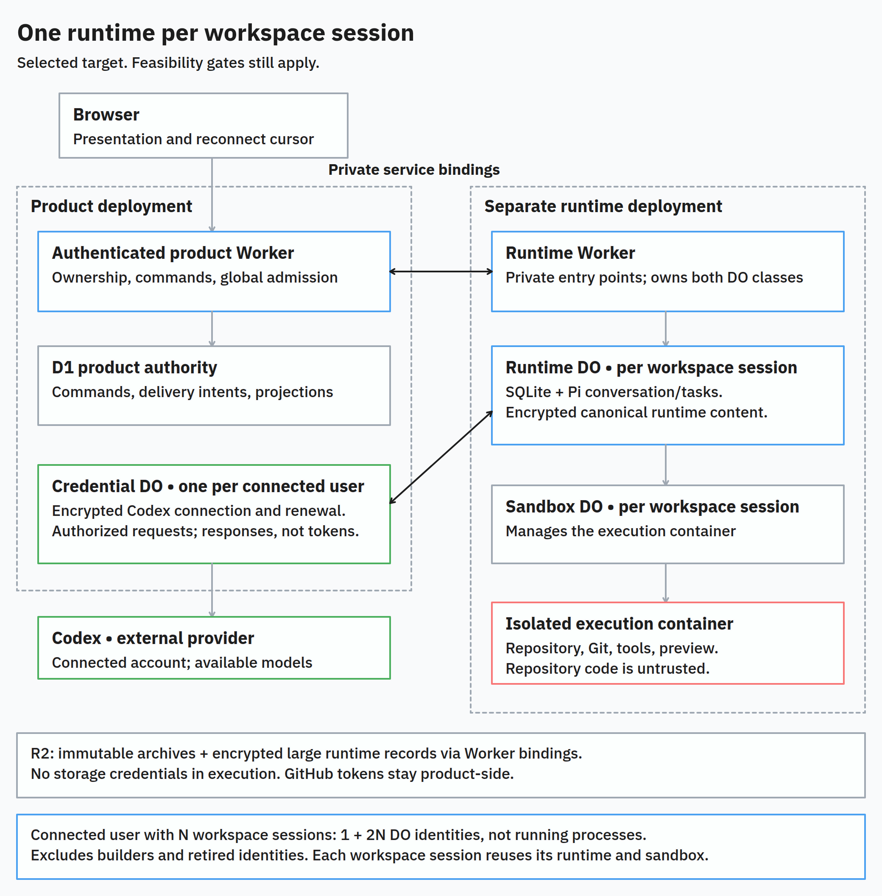
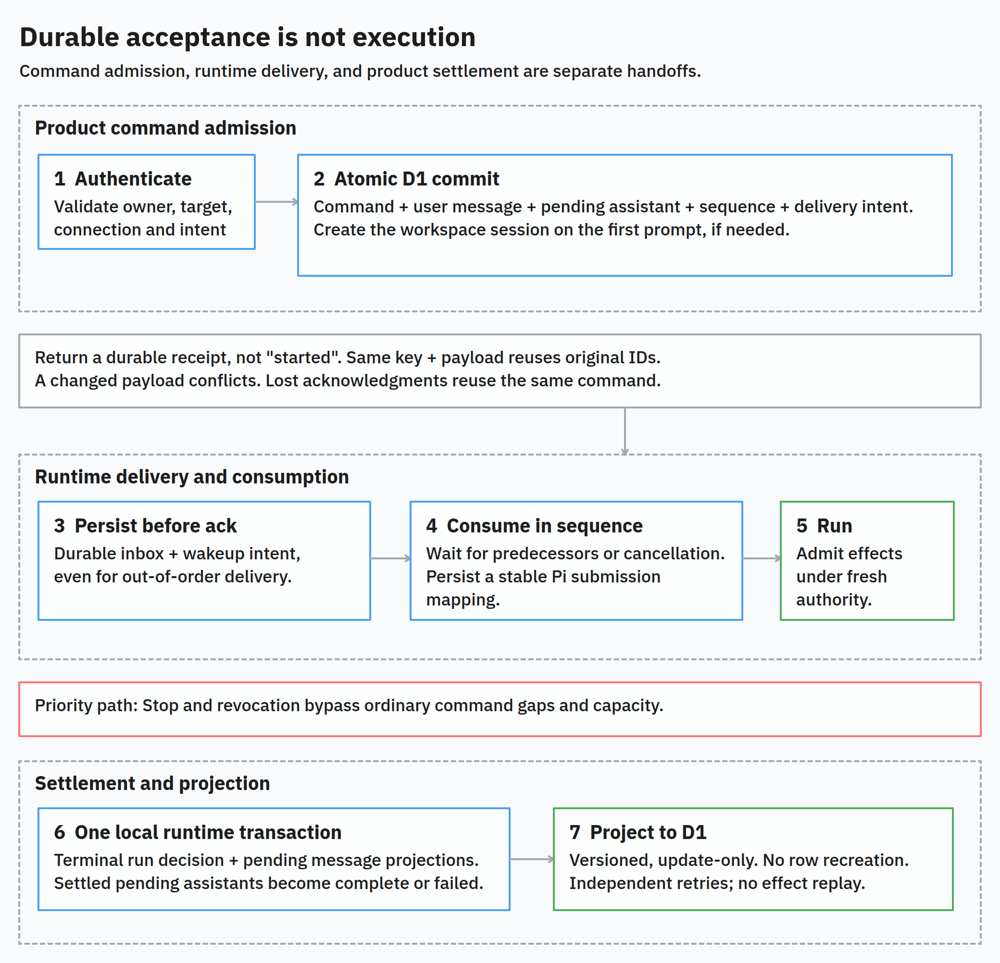
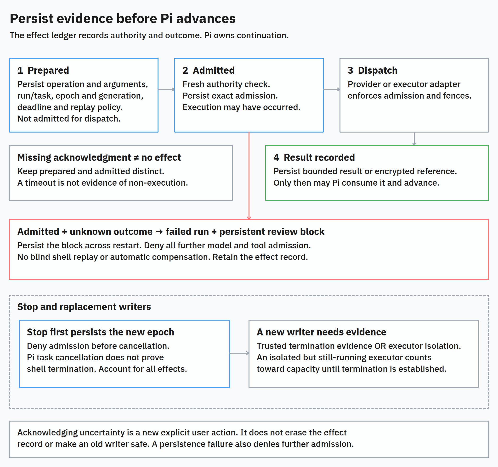
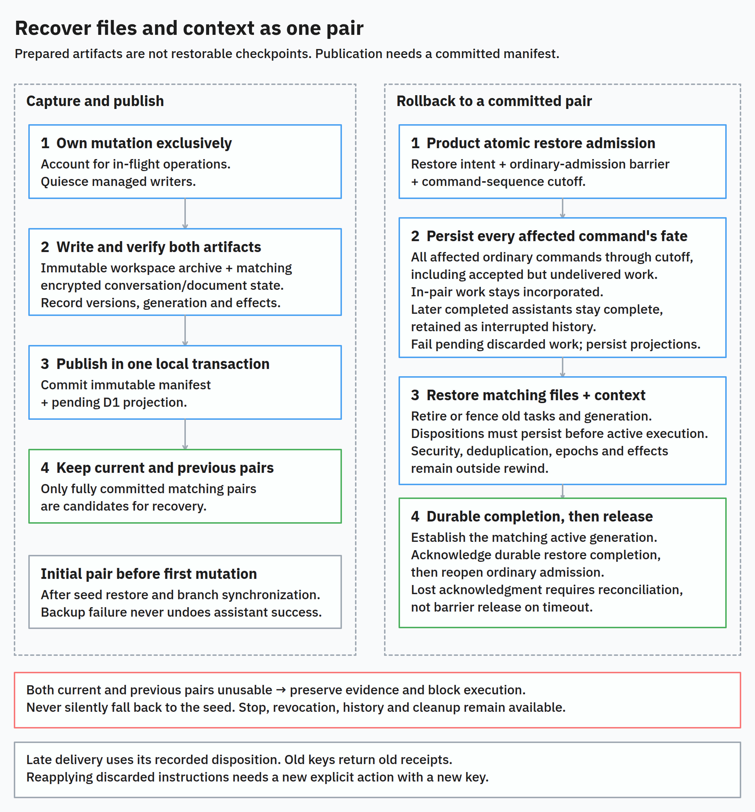
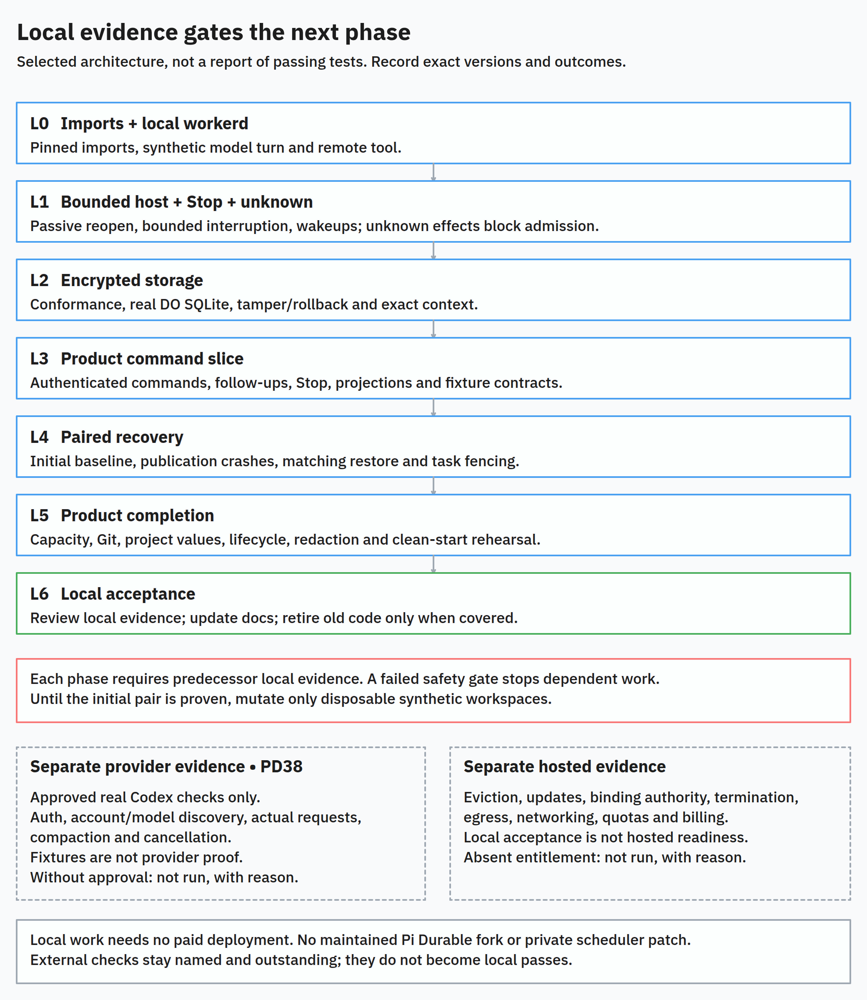

# Pi Durable workspace-session runtime

Status: authoritative target for new runtime plans and agent implementation. The architecture is selected. Implementation must pass the feasibility gates. The target is not yet validated.

Prepared against Ditto checkout `cff52d1`, using the maintainer discussion and [Pi Durable research](../research/pi-durable-cloudflare-architecture.md).

The maintainer selected a new architecture and a new set of implementation plans. All existing user-level data is disposable. This work does not require legacy import or a backup before reset. Local development must not depend on paid Cloudflare deployment checks.

These decisions do not authorize a reset, deployment, live database operation, staging, or commit. Each such operation needs separate approval.

This document replaces the [Node-based trusted workspace-session runtime specification](https://github.com/metaloozee/ditto/blob/52c9cef3ca2c471c69dfe4a0bdb3f507a8f45e13/docs/specs/trusted-session-runtime.md) for new runtime planning and implementation. Its requirements, module contracts, feasibility gates, and restrictions on unresolved decisions are authoritative. Historical plans, architecture summaries, and research must not override it.

Current code and tests still determine what runs today. Selection of this target does not mean that it already works. Existing implementation evidence applies only to its reviewed version. It does not prove that this engine works.

Plans must cite the applicable numbered decisions, local phases, PD test IDs, and maintainer-decision IDs. Plans may choose private implementation details. They must not change state ownership, module interfaces, trust assumptions, or failure behavior without an explicit specification amendment.

The [maintainer decisions](#resolved-maintainer-decisions) are resolved. They select user-provided Codex subscriptions, account-backed model selection, runtime ownership per workspace session, and essential code-level tests. Engineering compatibility and safety still need evidence. The authenticated command and observation interface remains the primary test interface.

## How to read this specification

The diagrams explain the written requirements. They do not replace them or add implementation guarantees. Each diagram has a PNG image, SVG export, and editable tldraw file in `docs/images/`.

- [Problem and solution](#problem-statement)
- [User stories](#user-stories)
- [Implementation decisions 1 to 18](#implementation-decisions)
- [Local implementation phases L0 to L6](#17-feasibility-first-implementation-sequence)
- [Testing decisions and PD01 to PD42](#testing-decisions)
- [Out of scope](#out-of-scope)
- [Maintainer decisions OD1 to OD7](#resolved-maintainer-decisions)
- [Engineering questions and references](#further-notes)

Use these terms consistently:

| Term | Meaning in this specification |
|---|---|
| Workspace session | One user's conversation and line of work in a project. It owns a branch, runtime, execution sandbox, and recovery lineage. |
| Runtime DO | The SQLite-backed Durable Object that owns the trusted runtime for one workspace session. |
| Trusted brain | Deployment-owned agent code inside the runtime. It is not a separate trusted container. |
| Execution sandbox | The untrusted environment for repository files, commands, dependencies, tests, and preview. |
| Durable acceptance | A stored receipt for accepted work. It does not mean that execution has started. |
| Effect admission | Permission for an exact model, tool, or other external operation to execute under current authority. |
| Reconciliation | A check of stored intent and available evidence to determine what happened and what may happen next. |
| Fence | A durable authority check that prevents stale or revoked work from acting. |
| Run epoch | A counter that prevents work from an older execution attempt from gaining new admission. |
| Paired checkpoint | An immutable workspace archive and its matching conversation position and required state. Restore uses both. |
| Product projection | A bounded, redacted product record derived from canonical runtime state. It is not a second agent transcript. |
| Feasibility gate | A required evidence check. Failure stops dependent implementation. |

[CONTEXT.md](../../CONTEXT.md) defines the broader domain vocabulary. This specification defines the runtime target, including the model-selection amendment.

## Problem statement

Accepted coding work must remain inspectable and controllable after the user closes the browser. A restart must not lose queued instructions or repeat a shell command. The conversation must not claim that edits exist when recovery restored older files.

The running implementation places Pi beside repository code in an untrusted sandbox. The previous target separated them. However, it required a trusted Node container, transport between coordinator and brain, and a second container-capacity pool. It also required custom reconstruction of the coding-agent SDK's continuation state.

That integration is incomplete. Pi Durable may already supply the required persistence for conversations and tasks. Ditto must test that possibility before it commits to maintaining the previous design.

The maintainer needs to test this locally, without buying a Cloudflare plan to start implementation. Local success must remain separate from hosted validation. Disposable development data must not force a complex legacy importer into the design.

## Solution

Give each workspace session one trusted runtime in a SQLite-backed Durable Object. Pi Durable owns agent conversation state and task continuation. A separate untrusted execution sandbox owns the repository, Git processes, dependencies, tests, and preview.

Users can submit durable commands, observe progress, queue follow-ups, stop work, inspect history, and recover a workspace. The browser does not control execution lifetime. Recovery restores files and agent context together. An unknown command outcome stops automatic execution. The model must not guess whether a repeat is safe.

Keep the product Worker, ownership checks, D1 product records, R2 recovery archives, and existing Git and project-value credential policies. Users connect their own Codex subscription. A product-side credential DO stores the encrypted connection outside Pi Durable and the execution sandboxes. Subscription-backed model selection replaces the fixed model.

Remove the trusted brain container and custom coding-agent continuation integration only after local feasibility gates prove a supported replacement.

Start new implementation plans instead of patching the old Node-specific plans. Reuse useful policies, code, and regression scenarios. Do not preserve an obsolete deployment structure. Legacy continuation import is not a delivery requirement. Any data reset remains a separate operation with an explicit scope and approval.

## User stories

The story numbers remain stable. Each story states the required capability and its purpose.

1. As a user, I want a durable receipt for an accepted prompt. A lost response must not lose my request.
2. As a user, I want identical retries to return the original receipt. Network failures must not create duplicate work.
3. As a user, I want rejection when different payloads use the same idempotency key. Different instructions must not silently share one receipt.
4. As a user, I want first-prompt retries to reuse the original workspace session. Retries must not create duplicate conversations or branches.
5. As a user, I want unauthorized or invalid commands rejected before side effects. Another user must not affect my work.
6. As a user, I want to see queued work and its expiry. I need to distinguish acceptance from execution.
7. As a user, I want to close the browser during a run. Execution must not depend on my connection.
8. As a user, I want committed history and current activity when I reconnect. I need to understand what happened while I was disconnected.
9. As a user, I want slow observation connections to recover without blocking the agent. Connection quality must not control progress.
10. As a user, I want follow-ups stored before acknowledgment. Accepted instructions must survive restarts.
11. As a user, I want follow-ups consumed in order. Later instructions must not bypass earlier instructions.
12. As a user, I want canceled follow-ups to remain visible. Cancellation must not erase what I asked.
13. As a user, I want Stop to bypass ordinary command gaps and capacity queues. Unrelated admission work must not delay cancellation.
14. As a user, I want Stop to target the exact run. A delayed control must not cancel newer work.
15. As a user, I want execution to remain visibly stopping until it is accounted for. A receipt must not falsely imply that shell processes have stopped.
16. As a user, I want replacement mutations blocked while an old process can still write. Two runs must not corrupt my workspace.
17. As a user, I want completed tool results retained across restarts. Completed mutations must not run again.
18. As a user, I want uncertain command outcomes to require review. Ditto must not silently repeat external effects.
19. As a user, I want compaction and provider context preserved. A recovered conversation needs that information to continue correctly.
20. As a user, I want failed automatic recovery to stop within a defined deadline. My workspace must not retry indefinitely without an explanation.
21. As a user, I want every settled run's pending assistants marked complete or failed. Stale pending messages must not imply ongoing execution.
22. As a user, I want separate model-success and backup-health states. A failed backup must not erase a completed answer.
23. As a user, I want restored files paired with their matching conversation position. The agent must not reason from edits that were lost.
24. As a user, I want later history retained as interrupted after a file rollback. I need to inspect lost work without automatically resuming it.
25. As a user, I want current and previous matching recovery points. A corrupt latest archive must not cause silent recovery from the original seed.
26. As a user, I want an initial recovery baseline before the first mutation. Even early work needs a defined recovery origin.
27. As a user, I want one isolated execution sandbox per workspace session. Another workspace session must not access my repository processes or files.
28. As a user, I want repository code outside the trusted brain. Dependencies must not replace the agent or read its private state.
29. As a user, I want project environment values available only to authorized commands. Builds need configuration without exposing it to unrelated processes.
30. As a user, I want secrets removed from ordinary output and product history. An accidental command print must not become a lasting disclosure.
31. As a user, I want sensitive canonical runtime history encrypted. Recovery must not create an unmanaged plaintext store.
32. As a user, I want to connect my own Codex subscription and choose an available model per workspace conversation. I want only its supported thinking options, so Ditto uses my selected subscription-backed model.
33. As a user, I want existing Git ownership and secret checks preserved. Moving the agent must not weaken export policy.
34. As a user, I want preview between turns and visible backup status. I need to inspect changes without assuming they are already recoverable.
35. As a user, I want preview stopped when safe checkpointing requires it. Recovery must not capture a falsely consistent workspace.
36. As a user, I want history reads without starting the execution sandbox. Inspecting old work must not consume execution capacity.
37. As a user, I want archived work to retain its final recovery state. Continuing it must create a separate line of work without changing history.
38. As a user, I want deletion to revoke authority before cleanup. Late work must not recreate a deleted project.
39. As an operator, I want one execution owner per workspace session. Old and new runtimes must not both mutate it.
40. As an operator, I want limits on execution, storage, observation buffers, and retries. One workspace session must not consume unlimited resources.
41. As an operator, I want admission accounting for executors, builders, preview, and model work. Removing the brain container must not remove resource control.
42. As an operator, I want task and adapter version checks on reopen. A deployment must not silently reinterpret retained work.
43. As an operator, I want durable wakeups that do not depend on clients. Interrupted execution and product projections must resume without a browser.
44. As an operator, I want local tests against the actual Worker runtime and SQLite behavior. Mocks must not hide incompatible platform assumptions.
45. As an operator, I want separate reports for hosted and local checks. An unrun deployment check must not appear as a pass or failure.
46. As a maintainer, I want feasibility work to test likely blockers first. I must not rebuild the product around an unsupported host integration.
47. As a maintainer, I want a new specification and new implementation plans. Old Node-specific requirements must not accidentally constrain the replacement.
48. As a maintainer, I want useful policies and tests retained. A new design must not discard useful behavioral knowledge.
49. As a maintainer, I want legacy data import excluded from initial delivery. Disposable development history must not dominate implementation.
50. As a maintainer, I want separate scope and approval for every destructive reset. Architecture approval must not erase unrelated work or resources.

## Implementation decisions

The words **must** and **must not** define target requirements. The resolved maintainer decisions constrain implementation. Unanswered engineering questions remain feasibility gates. They do not permit assumed guarantees.

Selection of this target does not authorize destructive operations or bypass of a failed gate.

### 1. Architecture and responsibility

[SVG](../images/pi-durable-architecture.svg) · [Editable tldraw](../images/pi-durable-architecture.tldr)

The product Worker checks authenticated ownership, accepts durable commands, and owns product records and global admission policy. It remains the only issuer of GitHub installation tokens. It does not run the model loop.

A separately deployed runtime Worker owns the workspace-session Durable Object class and the Sandbox class. Each workspace session has one runtime DO and one isolated execution sandbox. Its Sandbox DO manages that execution sandbox.

Prompts and agent runs reuse the runtime and sandbox for their workspace session. Neither a project nor a user has a shared Pi Harness that controls multiple workspace sessions. The runtime DO uses regular SQLite storage. It is not a container-backed trusted brain. Only the execution sandbox needs a repository execution container.

The product Worker owns one credential DO per connected user. This DO stores the encrypted Codex connection, coordinates token renewal, and performs authorized model requests. It returns no tokens to workspace runtimes. It does not run Pi, own conversations, or schedule workspace execution.

For a connected user with N workspace sessions, the target has `1 + 2N` DO identities. This excludes temporary seed builders and retained old identities. It counts identities, not continuously running processes or containers.

Private service bindings connect the Workers. The product Worker must not expose an arbitrary public proxy to privileged runtime methods. The runtime Worker must not become a public preview origin. Alchemy remains the only deployment owner.

Pi Durable is the selected feasibility candidate. It replaces the coding-agent SDK integration. It is not an extra persistence layer around an existing `AgentSession`. Do not retain two authoritative agent transcripts or two task-continuation engines.

Do not add another durable orchestration engine for the same conversation and task lifecycle. A failed feasibility gate requires an explicit architecture review. It does not permit Pi beside repository code or a silent change of engine.

### 2. Domain relationships

A workspace session continues to own these elements:

- A conversation and branch.
- A trusted session runtime and trusted brain.
- An execution sandbox.
- A recovery lineage.

The trusted brain becomes deployment-owned agent code inside the trusted runtime. It is no longer a separate Node process or container identity. A Pi conversation and a Pi task are implementation concepts. They do not replace a workspace session or agent run.

Initially, each workspace session has one active Pi conversation generation. Recovery may retain inactive generations as history. A conversation fork does not create a Git branch, restore files, retire old tasks, or authorize work.

Each Pi submission must have a durable mapping to a Ditto command and its message IDs. A Ditto agent run can include the initial prompt and accepted follow-ups. Do not infer its state from one task, a streaming flag, or a watch event.

Execution sandboxes and project-seed builders keep separate registered identities. Trusted routing and current product ownership establish runtime authority. A fabricated brain-container role or caller-supplied workspace identifier cannot establish authority.

### 3. Deep modules and their interfaces

Use the existing authenticated command and observation interface as the external boundary. Callers use Ditto intents, receipts, snapshots, and events. They do not handle Pi tasks, Sandbox stubs, storage transactions, or recovery steps. Routes and UI use this interface. They do not duplicate scheduling or recovery policy.

An interface defines ordering, authority, idempotency, failure modes, and resource behavior as well as methods. The modules below own those contracts. Their names describe responsibilities. They do not require specific packages, classes, or one-file implementations.

#### 3.1 Caller-visible contracts

| Module | Interface callers may use |
|---|---|
| Workspace-session commands | Submit an authenticated intent with an idempotency key. Observe owned receipts and history. Attach to committed observations with a cursor. |
| Trusted session runtime | Accept a delivered command reference. Apply a priority control. Read a committed snapshot and later events. |
| Workspace execution | Execute an admitted typed operation. Query or reconcile its outcome. Request cancellation or isolation of its executor. |
| Workspace recovery | Prepare capture or restore under exclusive mutation ownership granted by the runtime. Return verified artifacts or a classified failure. Clean unreferenced artifacts. |
| Privileged access | Check the owned Codex connection and discover available models and capabilities without returning credentials. Perform an exact authorized model, Git, or product operation. Obtain current authority and resource decisions. |

Workspace-session commands owns validation, first-session creation, atomic admission, sequence allocation, and delivery. It returns durable acceptance. HTTP success never means that execution started. It hides D1, the delivery outbox, and runtime transport.

The trusted session runtime resolves command content and ownership from trusted records. It owns run transitions, Pi submission mapping, effect admission, mutation ordering, wakeups, recovery decisions, and product settlement. It acknowledges delivery after durable inbox acceptance and wakeup intent. That acknowledgment does not mean ordered consumption or execution.

Workspace execution validates the exact runtime-owned operation and executor generation. It hides Sandbox lifecycle and tool/process protocols. It reports four distinct outcomes: known completion, known rejection before dispatch, pending reconciliation, or unknown effect. It never grants new authority or invents replay policy.

Workspace recovery hides archive streaming, integrity checks, extraction, encrypted snapshot content, and verification of current and previous artifacts. It cannot publish a usable pair or activate a conversation generation independently of the runtime.

Privileged access hides encrypted credential storage, serialized token renewal, credential attachment, and fresh ownership and expiry checks. It also hides token minting, global capacity, and execution-only delivery of project values. It never returns subscription or platform credentials. Caller-supplied IDs never establish authority.

Read-only history may use product projections without activating the runtime. Live observation uses the runtime when necessary. A read must never enable scheduling or wake the executor merely to return data.

Workspace-session commands is the product-facing module. The other interfaces are private implementation boundaries. Preview and UI Git submit typed intents through the same runtime owner. They do not have a second mutation path.

Project deletion and seed creation use existing owned project operations. Do not create a workspace session solely to route those operations.

#### 3.2 Dependency direction and composition

Product routes depend on workspace-session commands and stable product contracts. The command module depends on product persistence and narrow private runtime transport. Neither imports Pi, Sandbox implementation types, or runtime storage.

The trusted session runtime composes Pi Durable, conforming storage, workspace execution, workspace recovery, privileged-access adapters, and its private projection mapper. It alone makes execution decisions for its workspace session.

Workspace recovery may use narrow, admitted archive and restore operations from workspace execution. Its callers must not need to coordinate individual archive steps. Execution never depends on recovery. Both return evidence. The runtime decides checkpoint publication, active-generation changes, and run transitions.

Recovery uses the runtime's exclusive mutation scope. Every execution suboperation still passes the injected guarded admission interface. Each records its own outcome and checks the current epoch and executor generation. The scope does not authorize arbitrary shell execution.

Private admission checks may invoke short local state transitions. They must not recursively invoke a public runtime command. They must not wait on an orchestration lock held by their caller.

Assemble deployment dependencies at the Worker and DO entry points. Inject narrow storage, execution, provider, authority, clock, and wakeup dependencies there. Domain modules must not discover global environment bindings, import a product-wide environment type, or construct infrastructure clients on demand.

Share versioned data contracts and policy when both Workers need them. Shared contracts must not depend on a Worker framework, frontend, authentication implementation, database driver, or Pi. Reused runtime policy must not import product UI, authentication code, or secrets into the runtime.

Service-binding requests may pass through both Workers. This transport path does not permit circular domain dependencies. Product callbacks answer bounded authority, capacity, projection, or mint-and-fetch requests. A callback must not synchronously re-enter a runtime operation that is waiting for its response.

#### 3.3 Runtime internals with one owner

Keep these responsibilities together behind the runtime interface. They are not public modules or separate execution owners.

| Responsibility | Owner and limits |
|---|---|
| State transitions | Own runs, epochs, admitted effects, workspace mutation ownership, checkpoint publication, and pending projections. Other adapters must not write these tables or change this state directly. |
| Pi integration | Own extension registration, submission/task mapping, provider/tool adapters, and translation of committed framework state. Pi owns task continuation. Do not add another scheduler or transcript reconstruction engine. |
| Host lifecycle | Own passive activation, alarms, bounded interruption, and reactivation. Use the same guarded runtime transitions. Do not add a separate in-memory run lifecycle. |
| Projection mapping | Convert canonical state into bounded, redacted product records and events. Public callers never deserialize arbitrary Pi records. Projection retries never rerun execution. |
| Persistence | Own schema initialization, compatibility, encryption, record references, and transaction mechanics. Expose only the storage contract each caller needs. Do not expose raw SQL to product callers or tools. |

Use short local state transitions around external work:

1. Validate and commit intent.
2. Perform admitted I/O outside the transition.
3. Commit evidence conditionally against the recorded run, epoch, and generation.

Recheck mutable local guards after asynchronous preparation. Stop and deletion may occur during I/O. Reconcile late evidence against its original operation, not whichever run is now active.

Do not create one general-purpose coordinator method that accepts arbitrary callbacks or SQL. Do not wrap each state-machine action in a pass-through class. Private helpers may separate code without expanding the interface callers must learn.

#### 3.4 State changes and commit ownership

| Change | Sole decision owner | Durable fact required before the next effect |
|---|---|---|
| Accept user intent | Workspace-session commands | Atomic product command, message, and delivery records. |
| Accept runtime delivery | Trusted session runtime | Inbox record and wakeup intent before acknowledgment, even when predecessors are missing. |
| Consume ordered work | Trusted session runtime | Sequenced consumption and stable Pi-submission mapping before scheduling the instruction. |
| Fence admission for checkpoint rollback | Workspace-session commands | Restore intent, ordinary-admission barrier, and command cutoff committed together before restore execution. |
| Admit provider or tool execution | Trusted session runtime, with a fresh privileged-access check | Exact logical operation, authority scope, epoch, deadline, and executor generation where applicable. |
| Complete a tool | Trusted session runtime | Validated result or encrypted reference before Pi can advance. |
| Complete a run | Trusted session runtime | Terminal run decision and pending message projections in one local transaction. |
| Publish a paired checkpoint | Trusted session runtime | Verified immutable artifacts, matching conversation position and generation, and committed manifest with pending projection. |
| Restore files and active conversation | Trusted session runtime | Exclusive mutation ownership and a chosen committed pair. Prior tasks are retired or fenced. Security and effect records remain intact. |
| Project a result to D1 | Product projection adapter | Idempotent, update-only application for the exact target and ordering version. |
| Revoke a project | Product authority operation, enforced by runtime and privileged adapters | Durable deletion and retirement fences before content cleanup. |

Use one supported storage transaction for a Pi commit and a Ditto safety transition when possible. Otherwise, define an intent/evidence protocol and prove both crash orderings before accepting the integration. Shared SQLite storage alone does not prove atomicity.

The effect ledger and Pi task state have different responsibilities. The ledger decides whether further external work is authorized and records what is known about dispatched effects. Pi retains continuation state. Stable logical IDs and evidence references connect them. Neither replaces the other's authority.

#### 3.5 Failure and observation contracts

Expected failures use bounded, versioned domain outcomes with stable reason codes. Keep these outcomes distinct:

- Invalid or unauthorized.
- Conflict.
- Queued.
- Unavailable before dispatch.
- Recovering.
- Stopping.
- Outcome unknown.
- Incompatible state.
- Storage integrity failure.

Transport adapters map these outcomes to HTTP or private RPC responses. Product callers must not parse arbitrary exception messages.

A transport timeout is not a terminal execution result. Delivery retries reuse the same command. Effect retries follow the recorded policy and evidence, not a generic transport error. A new request ID does not turn a retry into a new logical effect.

Show run lifecycle, execution readiness, recovery health, and projection lag as separate facts. For example, a complete run may have degraded backup health or pending projections. An unknown effect may leave a failed run and a workspace blocked for review. Conversation cancellation does not prove that the executor has stopped.

Agent runs use these states:

| State or transition | Required meaning |
|---|---|
| `queued` → `starting` → `running` | Normal execution path. |
| `recovering` | Keep the run identity. Return to `starting` or `running` only after reconciliation. |
| `stopping` | Stop remains in progress until execution is accounted for. Uncertainty may instead settle the run as `failed` with a persistent block. |
| `complete` | All admitted instructions have settled. No run effect remains unresolved. |
| `failed` | Terminal failure. A separate uncertainty block may remain. |
| `canceled` | Terminal cancellation. No admitted authority remains. |

The `complete`, `failed`, and `canceled` states are terminal. An explicit new action creates a new run. It never revives a terminal run. Assistant messages use only `pending`, `complete`, or `failed`, not the run-state list.

Snapshots identify a committed cursor and the active run and conversation generation. Public observations contain only product-safe state and recovery actions. Keep archive references, crypto metadata, raw framework records, and executor authority internal.

#### 3.6 Real seams, depth, and acceptance

Add adapters only where this change needs variation:

- Real DO storage versus conformance and fault fixtures.
- Sandbox execution versus controlled failure execution.
- Provider requests versus deterministic fixtures.
- Platform wakeups and time versus a controlled clock.

Real and test adapters must share behavioral contracts. A permissive mock must not define different behavior.

The product has one selected agent engine. It does not need a hypothetical `AgentEngine` abstraction, universal repository layer, plugin framework, or generic workflow engine. Typed operation variants represent existing uses. They are not arbitrary names with untyped payloads. Parse unknown external data once at its owning interface, then return typed domain results.

Apply the deletion test to each module. Removing it should force meaningful policy or sequencing into multiple callers. Inline a wrapper if its removal eliminates no complexity. Keep interfaces that hide real work, even when they use several private helpers.

Future plans must identify the owner of each changed invariant, its existing test interface, and the old implementation it replaces. Module acceptance requires behavior tests through that interface. It also requires fault tests for every new persistent handoff and dependency checks for forbidden imports. More files or interfaces do not prove a better design.

### 4. Authoritative state and schema

| Location | Authoritative responsibility |
|---|---|
| D1 | Users, ownership, projects, and workspace-session identity. Codex connection ownership and status projections. Accepted commands, delivery intents, identity retirement, privileged-operation windows, global admission, product projections, and the archive registry. |
| User credential DO SQLite | Encrypted Codex credentials, token expiry, and renewal coordination. No Pi conversations or workspace execution state. |
| Runtime DO SQLite | Pi conversations, submissions, and tasks. Workspace model and thinking configuration. Ditto run epochs, effect decisions, active conversation generation, committed checkpoint manifests, event positions, wakeup intent, and pending projections. |
| R2 | Immutable workspace archives and encrypted oversized runtime records referenced by committed metadata. |
| Execution disk | Live repository and process state. Never the only durable copy of accepted work or agent continuation. |
| Browser | Presentation and reconnect cursor. Never execution authority. |

Reuse product command and delivery records where their contracts remain valid. Replace brain fields tied to the old deployment structure and custom continuation records. Do not retain them as a second authority.

Persist command-to-submission mappings, run-to-message membership, task/effect correlation, compatible engine and adapter versions, and the active conversation generation. Store wakeup deadlines and retryable projection intent durably.

No transaction spans D1, DO SQLite, R2, the model provider, and a shell command. Each handoff needs durable intent, idempotent acknowledgment where possible, and reconciliation. A framework commit does not prove that a remote effect committed or that a filesystem archive exists.

Security and effect records that must survive recovery must not exist only in rewindable conversation documents.

### 5. Commands, delivery, and settlement

[SVG](../images/pi-durable-command-flow.svg) · [Editable tldraw](../images/pi-durable-command-flow.tldr)

Prompt admission atomically stores the command, user message, pending assistant, sequence number, and delivery intent. The first prompt also creates the workspace session when necessary.

Scope idempotency to the authenticated owner and target. Identical requests return the original IDs. Different payloads conflict. Pi submission deduplication supports this contract. It does not replace payload-conflict checks or the D1 outbox.

The runtime stores inbox acceptance and wakeup intent before acknowledging delivery. This includes out-of-order commands. Acceptance is not ordered consumption.

Ordinary commands wait for predecessors or durable cancellation before Pi submission. Consumption and the stable command-to-submission mapping must survive interruption without loss or duplication. Lost acknowledgments and reordered delivery must not duplicate execution.

Reject prompts before prompt-side effects when any of these conditions applies:

- The Codex connection is missing or unusable.
- The selected model is unavailable.
- The thinking option is unsupported.
- Ownership checks fail.
- The workspace session is archived or deleting.

Recheck mutable connection and model authority before each admitted request. History and lifecycle actions that need no model remain available under their own policies.

Each follow-up retains its own user and assistant IDs. Consume follow-ups one at a time at supported turn boundaries. Keep canceled accepted work visible. Stop and authority revocation use a priority path independent of ordinary command gaps and capacity queues.

Commit terminal execution state and pending product projections together in local runtime storage. Retry projections independently of browser presence and model success. Use versioned, update-only projections. Late results must not overwrite newer state or recreate deleted rows.

Every settled run must eventually project all remaining pending assistants as complete or failed. Keep completed assistants complete when a later backup or follow-up fails.

### 6. Pi integration and tool behavior

Pin Pi Durable, provider dependencies, task definitions, tool contracts, and Ditto adapters as one compatible set. Reject unsupported state versions on reopen and show a recovery reason. An upgrade that changes persisted task meaning needs a tested migration or an explicit recovery block.

Only deployment-owned extensions and tools may run in the trusted runtime. Disable repository settings, executable extensions, MCP servers, skills, prompts, themes, and context discovery. Generated JavaScript and repository commands must not execute in the Worker. This architecture change does not introduce Codemode into the product agent.

Preserve the coding tools Ditto actually uses, including remote read, write, edit, bash, grep, find, and list behavior. Do not assume stock Pi Durable tools have equivalent behavior. Inventory and test attachment and image behavior before claiming parity.

All repository access uses the execution adapter. Remote failures must never fall back to Worker-local or host-local operations. Initially, execute tools sequentially. Serialize them with UI Git, restore, checkpoint, archive, and destruction operations.

Initially, support only Codex through the user's connected ChatGPT subscription. Pi Durable remains the agent engine. Do not add the Codex CLI as a second engine. This amendment replaces the fixed `opencode/deepseek-v4-flash-free` model and fixed `off`, `high`, and `max` thinking choices.

The model picker must contain models available through the connected subscription. Show only thinking options supported by the selected model. Discover account-backed models and capabilities through privileged access.

A bundled provider catalogue does not prove account entitlement. Establish a supported discovery or validation method before claiming that the picker reflects actual account access. Do not expose arbitrary provider destinations. Do not fall back to separately billed API access.

Remember model and thinking configuration per workspace conversation. Authenticated configuration intents go through the runtime owner. The UI must not access Pi directly.

Use Pi Durable's default change behavior:

| Request state | Configuration to use |
|---|---|
| Already prepared | Keep its existing model and request configuration. |
| Next model request | Use the changed configuration. This may occur within the same running instruction. |
| Queued instruction | Use the configuration in effect when its requests are prepared. |

Do not pin a model to an entire command at admission. Do not add a separate model-switch scheduler. Persist configuration and the actual model/request metadata needed to recover prepared requests correctly.

Validate actual request construction for selected models and supported thinking options. Cover normal turns, retries, follow-ups, compaction, cancellation, and Git metadata. A successful turn with another provider or a deterministic fixture does not prove the Codex subscription contract.

### 7. Durable host lifecycle

Keep one open Pi Harness per owning DO instance. Serialize state transitions. Do not hold a global concurrency block across a model call, sandbox call, or entire run.

On activation, perform these steps before allowing scheduling:

1. Open storage passively.
2. Inspect unfinished tasks and admitted effects.
3. Check current ownership and fences.
4. Reconcile the executor.

Treat submissions, compaction, abort operations, and waits that enable scheduling as privileged runtime transitions.

Use one alarm policy for runnable work, retry deadlines, unresolved effects, pending projections, and checkpoint publication. Persist wakeup intent before acknowledgment. Reconcile missed scheduling. Duplicate alarm delivery must be harmless.

Execution must fit bounded host invocations and preserve durable continuation. Infrastructure interruption is not user cancellation. Browser connections, process timers, unawaited promises, and `waitUntil` must not provide the only lifetime guarantee.

The inspected framework has no proven bounded host-pump integration for this use. Closing may wait on non-cooperative invocations. The first feasibility phase must prove supported interruption and reopen behavior without overlapping owners or private scheduler changes.

If supported interfaces cannot do this, stop dependent implementation. Report the required upstream change or alternative host decision. Do not hide the limitation with an endless alarm handler or a second continuation engine.

### 8. Execution evidence and uncertainty

[SVG](../images/pi-durable-effect-safety.svg) · [Editable tldraw](../images/pi-durable-effect-safety.tldr)

Before dispatch, persist these facts:

- Originating run and assistant.
- Pi task and tool identity.
- Validated arguments.
- Expected executor incarnation.
- Lifecycle generation and run epoch.
- Deadline and replay policy.

Keep operation states distinct:

| State | Meaning |
|---|---|
| `prepared` | Dispatch has not been admitted. |
| `admitted` | Execution may have occurred. |
| `result-recorded` | The bounded result or encrypted durable reference is stored. Pi may consume it only after this storage step. |
| `outcome-unknown` | The available evidence cannot establish the outcome. Automatic execution remains blocked. |

A missing acknowledgment does not prove that no effect occurred.

Persist the bounded result or an encrypted durable reference before Pi can consume it and request another effect. Duplicate results are idempotent. Conflicting results require a review block. A persistence failure denies further model and tool admission, even if Pi treats it as an ordinary recoverable error.

Mandatory provider and executor adapters enforce authority, Stop, persistence barriers, and unknown-effect blocks. Hooks alone are insufficient.

Pi unsafe-tool recovery may report interruption and continue the parent generation. Ditto must block every further model request and tool operation while the effect remains unresolved.

Read-only operations may repeat under an explicit new-observation policy. Structured writes need expected-content checks or equivalent idempotency support before replay can be considered. Do not automatically repeat or compensate arbitrary shell and external effects after uncertain dispatch.

An unknown effect fails the affected run and blocks the workspace session for review. The block survives restart. An explicit new user action may acknowledge uncertainty. It does not make an old writer safe or erase the effect record.

Sandbox-local receipts are diagnostic evidence. They are not platform authority or proof of exactly-once execution. Record model retries as separate attempts. They may spend again and produce different answers.

### 9. Stop, deadlines, and stale work

Stop first advances the run epoch durably and denies new admission. Only then does it request cooperative cancellation. A late control cannot revive its target run or cancel a distinct later run.

Show recorded Stop, applied Stop, stopping execution, and accounted-for execution accurately. Cancellation of a Pi task does not prove that a remote shell or background process has terminated.

A replacement mutating run must wait for trusted termination evidence or isolation of the previous executor. An isolated executor that still runs continues to consume capacity. Discarding work not included in a committed checkpoint requires an explicit recovery acknowledgment.

Keep the persisted 15-minute automatic recovery deadline, measured from the first interruption. Retries do not reset it. Expiry fails the run and revokes admission. Continue to track unresolved processes.

Tools and model attempts have finite persisted deadlines. The old whole-run timeout is not the new agent-run lifetime limit. Compaction and background work follow the same authority and Stop rules.

### 10. Encrypted storage adapter

Encrypt canonical runtime content before persistence to SQLite or R2. Cloudflare disk encryption does not replace application encryption.

Use versioned authenticated encryption with AES-256-GCM and unique nonces. Associated data must bind the owner, workspace session, record identity, and format version. Keep the runtime-state key separate from authentication secrets. Wrong-owner records, tampering, missing keys, and unsupported versions fail closed.

Implement a conforming Pi Storage backend or a reviewed supported extension. A SQL facade around the stock plaintext backend is permitted only for disposable synthetic feasibility data. It is not permitted for retained user content.

Specify which routing and ordering metadata stays queryable and which payloads are encrypted. Cover all of these representations:

- Transcript entries and submissions.
- Task checkpoints and model request state.
- Tool arguments and results.
- Document bases, deltas, and historical copies.
- Mixed atomic writes.

Encryption of final messages alone is insufficient.

Preserve transaction ordering, rollback, expired-handle rejection, scans, document materialization, and atomic mixed operations. Use actual DO transaction semantics. Concurrency blocking does not replace rollback. Do not await asynchronous work inside a synchronous transaction callback.

Bound every persisted representation. Offload or split oversized private data using an explicit encrypted format. Commit references only after the required content exists and passes verification. Restore must recover the original semantic content, not a truncated substitute.

After key rotation, referenced records must remain decryptable until re-encryption or authorized deletion. Verify storage bounds and exact context reconstruction under real local `workerd`. Defer performance benchmarks and optimization until the app is built. They are not initial local acceptance requirements.

### 11. Paired checkpoint publication and restore

[SVG](../images/pi-durable-checkpoint-restore.svg) · [Editable tldraw](../images/pi-durable-checkpoint-restore.tldr)

A committed paired checkpoint identifies these items:

- An immutable workspace archive.
- Its matching conversation position and required document state.
- Compatibility versions.
- Mutation generation and executor incarnation.
- The disposition of outstanding effects.

Establish the initial pair after seed restore and branch synchronization, before the first agent mutation. Capture later pairs at acknowledged quiescent run or Git-mutation boundaries. Per-tool filesystem archives are not required.

Publish a pair in this order:

1. Acquire exclusive mutation ownership.
2. Account for in-flight operations and quiesce managed writers.
3. Write and verify the archive bytes and encrypted runtime content.
4. Commit the immutable manifest and pending D1 projection together, only after both artifacts are usable.

Prepared objects are not restorable pairs. Keep the current and previous successful pairs. Restore files and context from the same pair. If neither pair is usable, preserve evidence and block execution. Never silently replace mutated work with the project seed.

Prefer a new active conversation generation rooted at a quiescent checkpoint. Retain later history as interrupted. The restore procedure must prove that old tasks, queued submissions, retries, and background work cannot restart when scheduling resumes. A fork alone does not prove this.

Restoring an older pair must also settle accepted instructions. Before restore execution, the product command module atomically stores these three facts:

- Durable restore intent.
- A barrier against ordinary admission.
- A command-sequence cutoff.

The cutoff covers ordinary work accepted before the barrier. Track the restore control separately. Its own dispositions must not cancel it. History, Stop, revocation, and cleanup remain available.

The runtime records a disposition for every affected command through the cutoff. This includes accepted commands whose delivery has not arrived.

| Command position | Required disposition |
|---|---|
| Already included in the selected pair | Keep it included. Do not submit it again. |
| Completed after the selected pair | Retain it as later interrupted history. Keep completed assistants complete. Preserve known and unknown external effects independently of restored files. |
| Interrupted, or accepted but unstarted, in the discarded execution history | Close it with a recovery reason. Fail its pending assistants. Do not automatically submit it against the older workspace, even if it never reached Pi. |

Persist these dispositions and their projection intents before activating new execution. They advance sequence processing without rewinding or deleting deduplication. A late delivery receives its stored disposition, not a new submission.

Reopen ordinary admission only after matching files and the active conversation generation are established. The runtime must also acknowledge a durable restore-completion record. Reconciliation repairs a lost acknowledgment. A timeout alone must not release the barrier.

To reapply affected instructions, the user must submit a new explicit action with a new idempotency key. A duplicate old command still returns its original receipt.

Test crashes before and after each of these steps:

- The cutoff commit.
- Each disposition batch.
- The active-generation change.
- Admission reopening.

No accepted instruction or authority may be silently lost.

Do not rewind ownership, deletion tombstones, command deduplication, run epochs, or unresolved external effects to match old files. Rolling back the whole coordinator is not workspace recovery.

A completed assistant remains complete if backup fails. Show degraded recovery health separately. Retry publication without repeating completed effects when the prepared content remains valid.

### 12. Credential and network contracts

The product Worker alone holds the GitHub App private key and mints installation tokens. Its user-level credential DO stores encrypted Codex connections and coordinates renewal. Encrypt access tokens, refresh tokens, and any retained identity tokens. Use versioned authenticated encryption bound to the owner and record.

Keep the credential encryption key product-side. The runtime Worker holds only its separate runtime-state encryption key. None of these credentials or keys may enter the execution sandbox.

The runtime Worker must not receive Codex subscription tokens, authentication secrets, GitHub OAuth secrets, or installation tokens. Its provider adapter requests an exact authorized model operation through private product-side transport.

The credential module checks current authority, reconstructs the validated upstream request, attaches credentials, and returns the response without tokens. Serialize renewal across a user's workspace requests. Rotating refresh tokens must not race.

The product side decrypts project environment values. It provides them only to a currently admitted execution command.

Only pinned deployment-owned code runs beside Pi in the runtime Worker. The subscription credential module belongs to the separate product deployment. It is not an extension that returns credentials to Pi. It grants model access only under current workspace authority. It is not a second conversation or task engine.

The intended user flow is to connect a Codex subscription, select an available model, and use the subscription allowance. Before claiming support, verify authentication, hosted-runtime compatibility, provider rules, renewal, and model discovery.

Restrictions for a separate Sign in with ChatGPT integration do not prove that Pi-style Codex access is blocked. Do not replace a local loopback callback with a public Ditto callback without proving support. Another agent harness's client identity or flow does not establish authorization for Ditto.

These are engineering checks. They are not an assumed general ban on hosted access or a requirement for API billing. Synthetic local feasibility work needs no credentials. Live subscription requests during development or verification require explicit approval. Normal application requests use the connected user's explicit actions and current operation authority.

Every privileged operation performs fresh checks of these facts:

- Ownership.
- Identity role, where applicable.
- Retirement and lifecycle generation.
- Run epoch.
- Operation window and expiry.

Queued work has no execution authority. Revocation must not wait for a product projection. D1 authority checks must not use a cache that extends revocation or expiry.

Each authority subject has at most one open operation per contract family. Three contract denials close that operation, halt the affected run, and mark the workspace session for review. They do not delete work. Already-admitted requests remain in flight until reconciliation. Later revocation cannot undo an external effect.

Use a narrow model adapter restricted to the connected Codex account, available models, and supported thinking options. Bound request validation, control retries, and record admission. Validate all of these request properties:

- Method, exact destination and path, port, and query.
- Content type and encoding.
- Streaming protocol.
- Complete bounded body schema.
- Operation type and contract version.

Reject duplicate or malformed authority fields, unexpected authorization or proxy headers, unsupported schemas, and redirects. Never forward an unvalidated original body or headers in a credential-bearing request.

Git metadata keeps one atomically reserved model attempt. Failure does not refund that allowance.

Git requests first pass runtime-side validation. The product side then performs a fresh authority check, mints a repository-scoped token, and fetches upstream. Attach credentials only to a reconstructed validated request. A privileged denial must never fall back to public network access.

Keep the credential-free execution network policy. Reject private, internal, and metadata destinations, and malformed authorities. Validate redirects and keep non-HTTP traffic disabled. Container egress interception does not restrict arbitrary `fetch` calls by trusted Worker code. Do not claim that it does.

### 13. Git, seeds, archives, and project values

Keep owned-repository and workspace-branch policies. Preserve closed, credential-free Git child environments, disabled hooks and credential helpers, fixed trust configuration, no redirects, and secret preflight checks. UI Git and agent Git use the same policy and mutation serialization.

Push and pull-request creation remain blocked until the required forbidden-ref and non-fast-forward rejection evidence exists. Architecture approval does not enable them. Agents cannot merge or close pull requests.

Projects retain immutable seeds and have no live project-wide runtime. Temporary builders have execution-only identities. They have no trusted brain, model authority, or project environment values. They fetch only the owned repository and retire permanently after completion.

Archive bytes move between fixed execution paths and Worker R2 bindings through bounded streams. Execution sandboxes and builders receive no storage credentials, object keys, signed URLs, bucket mounts, or internal bearer capabilities.

Preserve archive integrity, safe extraction, Git validation, current/previous fallback, and compatibility checks. Keep these configurable initial ceilings:

| Limit | Initial ceiling |
|---|---|
| Compressed archive | 1 GiB |
| Extracted archive | 3 GiB |
| Peak disk use | Within 70 percent of available capacity |

These ceilings do not prove that a particular runtime or free-tier storage budget can support them.

Initially, recovery archives contain source only. Archives that include dependencies and their representative cold-restore benchmark are deferred optimization work. They are not initial delivery requirements.

If dependency-inclusive archives are proposed later, retain the benchmark gate. It requires ten restores per path and at least 30 percent p95 improvement. This gate does not replace integrity checks or disk limits.

Project environment values enter only authorized repository commands. They must not enter these locations or processes:

- Repository environment files.
- Brain configuration.
- Builders or preview.
- Git transport children.
- Archive helpers or container entrypoints.

Repository commands can still leak values through output or allowed public traffic. Encryption and redaction do not promise complete prevention of exfiltration.

### 14. Observation, redaction, and retention

Expose bounded, redacted product snapshots and events. Do not proxy raw Pi views or watches to the browser. Do not treat them as a stable append-only audit interface.

Durable semantic events use monotonic positions. Reconnection returns a committed snapshot followed by later events without a gap. Duplicate delivery is harmless. A stale cursor receives a replacement snapshot.

Transient deltas identify their run, attempt, and committed position. A snapshot can then discard stale partial content.

Redaction covers secrets split across stream chunks, stderr, errors, structured tool payloads, and stored product messages. Detach slow subscribers without blocking execution. History and observation may activate the runtime DO to read storage. They must not enable Pi scheduling or wake the execution sandbox.

Retain canonical conversation history for the workspace session's lifetime, including archive. Active work and current/previous checkpoints retain all content they require. Keep detailed denials for 30 days. Unreferenced transient output becomes eligible for cleanup after 24 hours.

Deletion uses retryable cleanup. Do not assume one successful transaction across all stores.

Observability records trusted correlation IDs, versions, timings, statuses, byte counts, epochs, and reason codes. Never log raw provider records, decrypted continuation, credentials, archive content, Git pack data, or capability URLs.

### 15. Capacity, preview, archive, and deletion

Remove brain-container capacity reservations from the direct-DO target. Keep execution capacity accounting, including builders and preview-only work. Add explicit admission limits for concurrent model work and active runtime execution.

Keep execution-pool defaults of 20 global slots and two per user. These are configurable policies, not platform entitlements or claims of affordability.

Ordinary capacity waiting uses a durable FIFO queue, a persisted 15-minute expiry, and user cancellation. Stop, revocation, and cleanup bypass capacity acquisition. Resolve queue expiry against the runtime's actual execution decision. A lost acknowledgment must not let a dispatcher independently fail healthy work.

Before enabling multiple workspaces, provide bounded configurable admission, durable queue expiry, and live-executor accounting for execution and model work. OD3 defers benchmarks, numerical tuning, and optimization until the app is built. It does not defer admission control.

Earlier single-workspace experiments may use isolated disposable fixtures with a hard one-runtime/one-executor limit. They do not prove multi-workspace capacity behavior.

Lease expiry does not prove process death. Track live isolated executors until termination is established. Use conservative configurable safety limits for model work and active runtime execution.

Measured latency, memory, storage-write, tool-round-trip, concurrency, and cost thresholds are not initial acceptance gates. Do not claim unmeasured performance or cost savings.

Keep the fixed preview command, port 10000, product-origin routing, and authenticated delivery of revocable bearer preview URLs. Cold preview restores a committed pair without starting Pi.

Preview may defer checkpoint initiation for at most ten minutes after the first unbacked mutation. Later mutations do not extend this deadline. At expiry, stop preview and deny new mutation admission.

A read or expected-content structured write may finish within its own deadline. Cancel an arbitrary shell or unknown operation and mark its outcome unknown. Block the workspace for review instead of publishing a falsely consistent checkpoint.

After a checkpoint, restart preview only for recent traffic or explicit demand. Backup retry and preview restart remain separate actions. Preview-created application data is disposable.

Archiving requires stopped or isolated execution, a final committed pair, and revoked preview authority. Continuing archived work creates a new workspace session, branch, identities, and recovery lineage. It must not resume old pending tasks.

Project deletion first blocks admission and revokes authority. It then cancels work, revokes previews, terminates execution, and schedules content cleanup. Minimal non-secret retirement and deletion fences remain after content removal. Late commands and projections must not recreate deleted records.

### 16. Clean-start policy and supersession

This implementation does not require a legacy `AgentSession` importer, automatic continuation of existing conversations, or prolonged dual-engine compatibility. All existing user-level data is disposable. The maintainer requires no import, preservation, or export/backup before reset.

Source, deployment credential configuration, unrelated work, and historical review evidence are not disposable user data.

This scope decision is not a reset command. Preserve existing data, source, worktrees, plans, and review evidence until a separately named operation is authorized.

The eventual clean-start procedure must identify the exact environment and resources. It must revoke old authority, account for live work, and prevent late delivery before enabling the new owner.

For development, prefer isolated disposable local state over deletion of the existing environment merely to test the candidate. Never allow two active mutation owners for one workspace session.

Reuse command admission, delivery, ownership, Git policy, redaction, archive policy, crypto utilities, and useful regression scenarios after checking their new assumptions. Replace Node-specific continuation and transport rather than forcing compatibility. Historical passing tests do not automatically apply.

This specification is authoritative for the selected replacement. Git snapshot `52c9cef3ca2c471c69dfe4a0bdb3f507a8f45e13` preserves the old specification, topology-specific plans, reviews, and acceptance records. The [documentation index](../README.md) links to them.

The maintainer authorized removal of those obsolete files from the working tree after that snapshot. That approval covers documentation cleanup, not a data reset or implementation transition. Update implementation-facing documentation as each phase completes. Do not describe unimplemented behavior as current.

A failed feasibility gate stops dependent implementation. It does not silently restore the old architecture, permit waived requirements, or authorize deletion of either implementation. Reopen the affected decision explicitly.

### 17. Feasibility-first implementation sequence

[SVG](../images/pi-durable-local-gates.svg) · [Editable tldraw](../images/pi-durable-local-gates.tldr)

Test likely blockers before writing detailed tickets for all later work. L0 through L6 are ordered gates. Each phase requires the preceding phase's local exit evidence.

An explicitly deferred external check does not block unrelated local work. Keep it listed as outstanding. Every phase records exact versions, environment, commands, evidence, and status. Use `passed`, `failed`, or `not run`.

#### L0: runtime compatibility

Pin candidate imports and the toolchain. Bundle and run a synthetic model turn and a remote tool in local `workerd` with one execution sandbox.

Exit evidence must show no hidden Node filesystem or process dependency and no trusted-host fallback. Document local prerequisites.

#### L1: host lifetime and safety

Use disposable synthetic storage to prove passive startup, bounded interruption and reopen, durable wakeups, Stop, and unknown-effect blocking.

Exit evidence must show one owner and no unintended user cancellation. An uncertain effect must block model and tool admission, including after another restart. Failure stops dependent architecture work.

#### L2: durable private state

Implement conforming encrypted storage, version checks, size handling, document history, and transactional failure behavior.

Exit evidence includes upstream storage conformance and real local DO SQLite tests. Cover rollback, reopen, tampering, wrong owner, key rotation, history, and large records. Earlier plaintext fixtures must contain no real user content.

#### L3: one product vertical slice

Connect authenticated prompt admission, D1 delivery, Pi submissions, remote tools, and bounded resource admission. Include follow-ups, Stop, observations, terminal projections, and fixture-backed Codex connection and model configuration.

Essential command tests use disposable fixtures. They must survive duplicate delivery, sequence gaps, client loss, runtime restart, and projection outage. Contract-test credential boundaries, renewal, model discovery, configuration changes, and provider requests. Track approved actual-provider evidence separately under PD38.

#### L4: recoverable workspace

Implement initial and later paired checkpoints, safe generation retirement, restore and fallback, seeds, Git serialization, and preview quiescence.

Every publication crash point must be safe. Restored older files must use matching context. Preserve effect and security fences. Prevent old tasks from executing.

#### L5: product completion

Complete bounded resource policy across agent, builder, and preview demand. Complete project creation, Git and project-value contracts, archive/continue, deletion and retention, redacted reconnect behavior, and local clean-start rehearsal.

Exit evidence covers the essential locally runnable code-level behavior matrix and supported product operations. It must show no competing execution owner. Benchmarks and automated UI tests are not required. Keep deferred external checks named.

#### L6: local acceptance and implementation transition

Review evidence against the resolved maintainer decisions. Update implementation-facing documentation. Retire Node-specific implementation only after replacement behavior is covered.

Record explicit local code-level acceptance against this target. Preserve old evidence and record hosted readiness separately. Future independent browser QA provides final visual and user-level acceptance. Any actual reset or deployment still needs separate approval.

#### Constraints across phases

Until L4 proves the initial paired baseline, mutating demos and fault tests may use only explicitly disposable synthetic workspaces. L3 must not enable a retained user workspace without the baseline in [decision 11](#11-paired-checkpoint-publication-and-restore).

The baseline may be implemented early if it is proved before the first retained mutation. Later restore and publication coverage still belongs to L4.

Implement a slice's credential policy before real secrets or external effects enter that slice. Provisional resource admission must precede multi-workspace execution. Phase order does not permit deferring access control or resource limits until L5.

If L1 needs fragile private APIs, a second task engine, or a maintained fork, stop and review. Maintained Pi Durable forks are not allowed. Report library flaws for an upstream issue or fix. Wait for supported interfaces. Do not silently patch private scheduler behavior.

If encrypted storage or paired restore fails, do not weaken the guarantees to keep the schedule.

### 18. Local completion versus hosted readiness

Local development and acceptance require no paid Cloudflare deployment. Use actual local `workerd`, SQLite-backed Durable Objects, and Docker-backed execution through the existing Alchemy development path. Do not add another deployment owner or combine this work with a Sandbox SDK protocol migration.

Local tests must inject interruptions and duplicate wakeups. Simulated eviction and mocked platform identity are not hosted evidence.

Use deterministic provider fixtures for faults, subscription/model contracts, and request-shape tests. These fixtures must not consume subscription allowance. Real-provider compatibility is a separate gate. It requires explicit approval to use credentials and allowance. Fixture success does not prove it.

Validate these hosted behaviors separately:

- Eviction and deployment/update behavior.
- Service-binding authority.
- Execution termination and egress interception.
- Provider networking.
- Quotas and billing.

If the account lacks the required entitlement, record `not run` and the reason. Do not report an architectural failure.

The hosted execution sandbox still needs the appropriate Cloudflare plan. Removing the brain container does not make the full product deployable on the free tier.

Local acceptance means the tested local architecture and behavior are complete within the stated limits. It does not authorize deployment or prove hosted production readiness. A later platform failure requires review of the affected design, not a silent security downgrade.

## Testing decisions

### Primary seam

Use the confirmed authenticated workspace-session command and observation interface. Submit prompts, retries, follow-ups, Stop, recovery decisions, and lifecycle/configuration actions through product handlers. Assert receipts, messages, snapshots, events, resulting files, recovery state, and rejection of unauthorized effects.

Test project creation through its existing owned project-operation interface. Do not create a workspace session solely for this test path.

Use the same interface for essential code-level fault scenarios. Do not expose coordinator internals or task-control methods only to simplify tests. Keep useful injected-auth tests and label them accurately. Retain a bounded real-auth HTTP smoke test. Injected identity does not prove cookie authentication. The smoke test is a backend HTTP check, not a UI test.

OD5 confirms this interface and essential-only testing. This work does not require or authorize automated UI tests, render/mount checks, visual snapshots, styling assertions, or broad browser test suites.

### What makes a good test

A good test proves an observable guarantee that can regress. For example:

- A lost acknowledgment must not create two runs.
- A crash after shell admission must block new effects.
- Restore of an old archive must not leave newer context active.

File-existence, class-name, and successful-mount assertions alone are insufficient.

Use deterministic clocks, crash points, provider fixtures, and fault-injecting execution adapters behind existing interfaces. Pair them with real local `workerd` and DO SQLite tests where Node-only doubles cannot prove behavior.

Focused conformance tests below the primary interface are justified for storage and cryptography. They must cover the upstream contract, not invent a second application interface.

Prioritize project creation, tool calling and execution, ownership, durable commands, Stop, recovery, credential protection, and model configuration. Use the nearest practical test interface. Do not add elaborate mocks, large new test systems, duplicate suites, or coverage quotas merely to increase test counts.

For a regression with a cheap executable reproduction, show failure before the fix and success afterward. If that is impractical, record why and use the nearest useful check. Never weaken assertions to fit an incorrect implementation.

Deterministic tests make no live model calls. Real-provider checks require explicit approval and separate reporting of subscription usage.

Later independent browser QA, through a verification skill, covers visual and user-level behavior. Agent-authored tests do not establish that acceptance. Browser QA does not replace essential code-level safety checks. Creating that skill is outside this specification update and early implementation phases.

### Prior art and modules

Reuse behavioral patterns from these existing tests:

- Command admission and delivery.
- Runtime journal and control.
- Projection and runtime crypto.
- `SandboxAuthority` and `SandboxEgressBroker`.
- Workspace capacity and recovery.
- Git policy and redaction.

Existing Pi restoration tests prove behavior only for the old SDK. Carry forward scenarios such as completed-result recovery, compaction boundaries, and follow-up consumption. Use new Pi Durable fixtures and crash points.

Test all five modules primarily through the shared product interface. Use focused storage, provider, and crypto contracts where that interface cannot honestly establish the fault.

### Required local behavior matrix

These IDs identify essential backend scenarios. They do not prescribe a number of tests or files. Combine related scenarios through the nearest useful interface and keep setup focused. Client detachment, observation, and preview scenarios test backend behavior, not automated UI behavior.

| ID | Fault or action | Required observation |
|---|---|---|
| PD01 | Target is foreign, archived, deleting, disconnected from its subscription, or configured with an unavailable model or unsupported thinking option. | Reject before command, provider, or sandbox effects. |
| PD02 | Identical retry, including the first prompt. | Return the original receipt, workspace session, and message IDs. Keep one logical command. |
| PD03 | Same key with a changed payload. | Return a conflict. Create no extra submission or message pair. |
| PD04 | D1 commits before interrupted delivery, or the runtime acknowledgment is lost. | Deliver eventually without duplicate execution. |
| PD05 | Ordinary commands arrive out of order, with cancellation. | Consume in order or apply explicit durable cancellation. Never skip silently. |
| PD06 | Stop arrives with missing predecessors or exhausted capacity. | Apply the priority control. Delayed targeted work cannot start. |
| PD07 | Browser detaches and the product Worker restarts. | Execution continues or recovers without browser-owned lifetime. |
| PD08 | Runtime is interrupted and reopened repeatedly. | Reconcile passively before effects. Keep exactly one active owner. |
| PD09 | Host yields within a bounded invocation during model or tool work. | Durable progress remains recoverable. Infrastructure yield is not user cancellation. |
| PD10 | Alarm scheduling is missed, wakeups duplicate, or a handler fails. | Reconcile retained wakeup intent without duplicate effects. |
| PD11 | Crash after a completed model/tool result, during compaction, or during follow-up consumption. | Preserve original IDs, provider metadata, context, and queue position. Do not repeat completed mutations. |
| PD12 | Shell is admitted but its result commit is missing, followed by two restarts. | Persistent uncertainty blocks every further model and tool admission. |
| PD13 | An adapter's persistence barrier fails. | No later provider or executor effect occurs, even if Pi reports a recoverable error. |
| PD14 | Shell ignores cancellation and a stale result arrives. | Block replacement writers until termination or isolation. Stale state cannot overwrite current work. Keep live capacity accounted for. |
| PD15 | Model retries after interruption. | Show the new attempt and possible extra spending. Make no exactly-once billing claim. |
| PD16 | Recovery deadline expires. | Fail pending assistants. Continue to account for unresolved execution. |
| PD17 | Storage rollback, unrelated concurrent operation, or expired transaction handle. | Backend ordering and rollback conform to the upstream contract. |
| PD18 | Ciphertext tampering, wrong owner, or missing/rotated key. | Fail authentication closed, or correctly decrypt authorized historical records. Never fall back to plaintext. |
| PD19 | Document deltas/history, atomic mixed writes, or oversized task/request state. | Restore exact semantic content with bounded storage and verified references. |
| PD20 | Crash at each paired-publication stage. | Only fully committed matching pairs are restorable. |
| PD21 | Edit completes after the last archive, then the executor is lost. | Restore matching older files and context. Mark later history interrupted. Keep security and effect records current. |
| PD22 | Resume after restoring a child conversation generation. | Old tasks, submissions, and background work cannot execute. |
| PD23 | Current pair is corrupt, then the previous pair is corrupt. | Use a matching fallback or block explicitly. Never silently restore the seed. |
| PD24 | Assistant succeeds, then backup or D1 projection fails. | Preserve assistant success. Show recovery degradation and projection lag separately. Both remain retryable. |
| PD25 | Preview repeatedly mutates during backup deferral. | Keep the first deadline fixed. Block unsafe capture instead of publishing a false checkpoint. |
| PD26 | Slow observer, duplicate events, stale cursor, or split secret. | Agent progress continues. A snapshot repairs state. Output stays bounded and redacted. |
| PD27 | History read or event subscription while execution is stopped. | Do not wake the sandbox or activate Pi scheduling. |
| PD28 | Executor or builder requests model, control, or storage privilege. | Deny before credential attachment or a privileged side effect. |
| PD29 | Repository shadows tools, configuration, extensions, or paths. | No trusted-runtime execution and no local-tool fallback. |
| PD30 | Inspect project values, Git children, archives, and preview. | Values appear only where authorized. Platform credentials never enter execution. |
| PD31 | Wrong branch, forbidden Git request, malformed authority, or expired/revoked operation. | Fail closed without public-network fallback. Push remains gated. |
| PD32 | Concurrent executor, builder, preview, and model demand. | Configured limits hold. No duplicate claim or unaccounted live resource exists. |
| PD33 | Queue expiry races with a lost handoff acknowledgment. | Runtime resolves actual start versus expiry. Accepted instructions stay visible. |
| PD34 | Archive/continue or deletion races with tasks, publication, or projection. | New lineage never resumes old work. Revoke before cleanup. Do not recreate deleted state. |
| PD35 | Garbage collection runs with current/previous pairs and active recovery. | Referenced content survives. Clean unreferenced content under retention policy. |
| PD36 | Reopen with an incompatible engine, task, or adapter version. | Show a recovery block. Do not silently reinterpret state. |
| PD37 | Clean-start rehearsal has late old commands and live execution. | Fence old authority before new ownership. No accidental import or competing writer occurs. |
| PD38 | Approved actual Codex authentication, account/model discovery, selected-model request, response, compaction, and cancellation. | Prove the subscription contract for the tested account and model. Do not substitute mock success or a generic catalogue for provider evidence. |
| PD39 | Real-auth HTTP smoke with missing, expired, foreign, and valid sessions. | Prove public authentication and ownership behavior separately from injected-auth tests. |
| PD40 | Restore cutoff races with accepted follow-ups, undelivered commands, disposition commits, and admission reopening. | Give every affected command a durable fate. Settle pending assistants and retain old-key deduplication. Never strand or replay instructions against older files. |
| PD41 | Owned project creation, Codex connection access, cross-workspace renewal, or revoked connection. | Preserve correct product records and seed-builder lifecycle. Prevent foreign credential access, token exposure to runtime/sandbox/history, and racing token replacement. |
| PD42 | Account-model discovery, thinking validation, or model change during running/queued work. | Accept only account-backed models and capabilities. Keep workspace selections independent. Prepared requests retain configuration. Later requests follow Pi Durable's default change behavior. |

PD38 may remain `not run` during credential-free local development. Live requests require explicit approval. Record it as an outstanding provider-validation gate. Do not describe the integration as fully verified against the selected provider.

### Verification and evidence

Use the nearest existing test commands during implementation. Run narrow web tests with `pnpm --filter @ditto/web exec vitest run <paths>`. Use the existing runtime test command and add real `workerd` coverage for the new backend and host.

Keep `pnpm verify` and `pnpm runtime:verify` as inherited checks while adding the new runtime's required tests to repository verification. Verify retained brain code while it remains in scope. Do not keep an obsolete package only to preserve a historical test count.

Evidence for this specification is limited to documentation structure, links, diffs, and diagram checks. Listing a test or gate here does not mean that it passed. This document provides no runtime, import-bundle, encrypted-adapter, provider-turn, eviction, benchmark, or deployment evidence.

Record exact package versions, toolchain, compatibility date, and image digest where applicable. Include the environment, commands, result, and evidence limits. Never include secrets, raw provider content, archive bytes, or capability URLs.

## Out of scope

- A second agent engine, or permanent competing ownership by old and new runtimes.
- A trusted Node brain container in the direct-DO target.
- Repository execution, repository-selected extensions or MCP servers, or model-generated code inside the trusted Worker.
- Legacy continuation import, automatic migration of old agent sessions, or preservation of all development data as a delivery prerequisite.
- A reset, database drop, live cleanup, deployment, paid-platform experiment, staging, or commit authorized by this document alone.
- A whole-application rewrite, replacement of Ditto sign-in authentication, broad UI redesign, or enabling terminal/code-browser tabs. Codex connection, model selection, and supported thinking controls remain in scope.
- Additional subscription providers, API-key billing fallback, or a new per-token billing product.
- Benchmarks and optimization before the app is built, automated UI suites, coverage quotas, or early creation of the future browser verification skill.
- A maintained Pi Durable fork or private scheduler patch that bypasses a failed feasibility gate.
- A concurrent Sandbox SDK protocol migration or another deployment path.
- Exactly-once arbitrary shell effects, automatic compensation, or blind replay after uncertainty.
- Full-VM snapshots, live process migration, shared execution across workspace sessions, or independently mutating subagents.
- Preservation of preview-generated application data or complete prevention of project-value exfiltration.
- Git push or pull-request creation before the existing gates pass.
- Use of local acceptance as proof of hosted production readiness.

## Further notes

### Resolved maintainer decisions

The maintainer confirmed these decisions in the specification interview and approved the amendment. OD1 through OD5 keep their identifiers for existing references. No maintainer decisions remain open in this specification. Engineering evidence and separate operational approvals are still required.

| ID | Topic | Approved decision | Implementation consequence |
|---|---|---|---|
| OD1 | Subscription credential trust | Start with user-provided Codex subscriptions. One product-side credential DO per connected user holds encrypted tokens and coordinates renewal outside Pi Durable. | Private authorized model requests return responses, not credentials. Tokens never enter runtime Workers or sandboxes. Supported authentication and discovery remain engineering gates, not an assumed general ban on hosted access. |
| OD2 | Framework support | Stop and review library flaws. Seek an upstream issue or fix. No maintained fork. | Failed supported-lifecycle gates stop dependent work. No private scheduler patch or second engine. |
| OD3 | Performance and capacity | Defer benchmarks, numerical tuning, and optimization until the app is built. Keep conservative configurable safety limits. | No measured performance or cost acceptance gate. Storage bounds, deadlines, admission, queue expiry, and live-resource accounting remain mandatory. |
| OD4 | Existing data | All existing user-level data is disposable. No legacy import, preservation, or export/backup before reset is required. | Separately authorize each reset and name its environment and resources. Preserve source, deployment credential configuration, unrelated work, and historical evidence. |
| OD5 | Verification | Keep the authenticated command/observation interface and essential code-level tests only. No automated UI tests. | Focused storage, crypto, provider, and bounded backend-auth checks remain useful. Avoid elaborate test systems. Live provider tests need approval. Future independent browser QA provides final visual and user-level verification. |
| OD6 | Runtime ownership | One runtime DO and one execution sandbox per workspace session, reused across its runs. | Do not share a user-level Pi Harness across workspace conversations. The credential DO shares credential management only, not runtime ownership. |
| OD7 | Model behavior | Remember subscription-backed model selection per workspace conversation. Offer supported thinking options and use Pi Durable's default change behavior. | Prepared requests retain configuration. The next request uses changes, even within a running instruction. Do not pin queued work at command admission. No automatic API-billing fallback. |

Unknown-effect blocking, encrypted canonical state, paired recovery, one execution owner, and local-first development remain requirements from the previous design.

### Engineering questions to answer with evidence

Establish these facts through feasibility work, not maintainer intuition:

- Exact compatible Pi, provider, and toolchain versions, and the complete `workerd` import graph.
- Supported bounded interruption, close/reopen behavior, durable wakeups, and no overlapping owners.
- Encryption of every private representation without breaking history, scans, transactions, or size bounds.
- A safe procedure to retire or fence every old task and submission before activating a checkpoint-derived conversation.
- Supported Codex authentication locally and when hosted. Include provider rules, encrypted credential renewal, account-backed model/capability discovery, and exact request behavior without exposing tokens to Pi.
- Tool and attachment parity, default per-conversation model changes, and compliance with configured safety and resource limits. Performance measurement remains deferred optimization work.
- Which platform identity, process termination, egress, eviction, and billing behavior cannot be validated locally.

Do not treat an unanswered question as a guarantee. Failed local safety gates stop dependent implementation. Unavailable paid-platform checks remain separately marked `not run`.

### Disposition of existing work

Existing command admission and delivery, identity and ownership policies, effect safety, crypto utilities, projection ordering, Git rules, redaction, and recovery scenarios may be reused. They are not automatically valid unchanged under the new engine.

The selected target replaces the trusted Node image, Node-to-DO bridge, coding-agent continuation procedure, and brain-container capacity ledger. Remove them only after replacement behavior is demonstrated and the implementation transition is reviewed.

Old topology-specific plans must not direct this candidate's implementation. Their original content and reviews remain in the linked Git snapshot, not the active planning directory. Derive new detailed tickets from this amended specification and its ordered feasibility gates. Resolved choices do not prove engineering compatibility.

### Publication and references

The issue tracker was not configured or identified in the specification discussion. The specification is stored locally. No issue has been published and no label has been applied. Run `/setup-matt-pocock-skills` to configure the tracker. The requested label for eventual publication is `ready-for-agent`. Keep technical gates and resolved decision references explicit in the issue.

Relevant sources:

- [Pi Durable architecture research](../research/pi-durable-cloudflare-architecture.md). Includes pinned upstream storage, scheduler, and tool evidence.
- [Historical Node-based specification](https://github.com/metaloozee/ditto/blob/52c9cef3ca2c471c69dfe4a0bdb3f507a8f45e13/docs/specs/trusted-session-runtime.md). Contains prior decisions and implementation evidence. This document states the requirements to retain.
- [Ditto domain context](../../CONTEXT.md) and [product brief](../../PRODUCT.md).
- [Historical plan and evidence index](https://github.com/metaloozee/ditto/blob/52c9cef3ca2c471c69dfe4a0bdb3f507a8f45e13/plans/README.md). Describes historical implementation status, not acceptance of the new engine.
- [Cloudflare local container development](https://developers.cloudflare.com/containers/guides/local-dev/). Describes differences between local and hosted execution.
- [Cloudflare Sandbox SDK](https://developers.cloudflare.com/sandbox/sdk/). Includes the hosted plan requirement.
- [Pi Durable per-conversation agent configuration](https://github.com/earendil-works/pi/blob/7fbbd5f4a1d982bb02d63472dde0774fa639f99b/packages/durable/README.md#per-conversation-agent). Describes prepared-request and next-request model-change behavior.
- [OpenAI Codex authentication](https://developers.openai.com/codex/auth) and [OpenCode subscription configuration](https://opencode.ai/docs/providers#openai). Describe subscription access patterns. They do not prove Ditto's hosted integration.
- [OpenAI account/session guidance](https://developers.openai.com/siwc/token-sharing-open-source/profiles-and-sessions). Covers token protection and serialized renewal. Its separate integration rules do not establish support or restrictions for a particular Codex authentication path.
- [ASD-STE100 overview](https://www.asd-ste100.org/about.html) and [FAQ](https://www.asd-ste100.org/STE_faq.html). Inform this document's writing style, not its architecture or acceptance gates.

This document specifies a target and implementation sequence. It is not executable deployment instructions or evidence of runtime validation.
