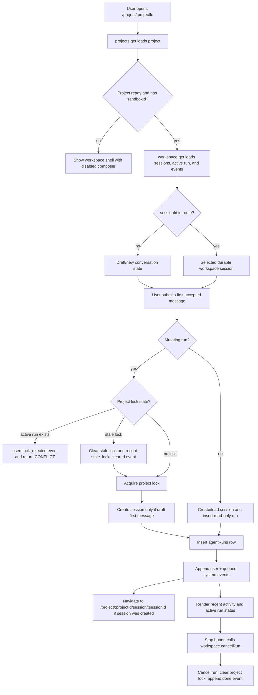

# Plan 008: Add project-scoped agent run foundation

> **Executor instructions**: Follow this plan step by step. Run every
> verification command and confirm the expected result before moving to the
> next step. If anything in the "STOP conditions" section occurs, stop and
> report — do not improvise. When done, update the status row for this plan
> in `plans/README.md` — unless a reviewer dispatched you and told you they
> maintain the index.
>
> **Drift check (run first)**: `git diff --stat 448676f..HEAD -- docs/repo-sandbox-coding-workspace-prd.md src/db/schema.ts migrations src/lib/workspace-policy.ts src/lib/workspace-policy.test.ts src/integrations/trpc/router.ts 'src/routes/project.$projectId.tsx' 'src/routes/project.$projectId.session.$sessionId.tsx' src/routes/index.tsx src/routes/__root.tsx src/components/ai-chat.tsx src/components/composer.tsx src/components/app-sidebar.tsx`
> If any in-scope file changed since this plan was written, compare the
> "Current state" excerpts against the live code before proceeding; on a
> mismatch, treat it as a STOP condition.

## Status

- **Priority**: P1
- **Effort**: L
- **Risk**: MED
- **Depends on**: plans/003-sandbox-provisioning-and-bootstrap.md
- **Category**: direction / feature
- **Planned at**: commit `448676f`, 2026-06-26

## Why this matters

Ditto is intended to be a repo-native AI coding workspace, not a blank-slate app generator. The product decision for v1 is: one long-lived Cloudflare Sandbox per project, with logical chat/work sessions inside that project sandbox. The agent should have broad permission inside its sandbox, but only one mutating agent run may operate on a project at a time; memory helps continuity, while database locks and git state provide correctness.

This plan creates the substrate for that model before wiring a real LLM agent. After it lands, the app will have explicit workspace sessions, agent runs, run events, and a project-level mutating-run lock that future read/write/command tools must honor. It intentionally does **not** add tool-approval UX: inside the sandbox the agent can operate freely; later plans should require explicit user action only for outside-world effects such as GitHub push/PR, sandbox destruction, or production deployment.

## Product brief

- **Job**: A founder/engineer opens an existing GitHub project in Ditto and asks an agent to work in that project without local setup. Today, the app can create a project sandbox but has no durable agent-run model or concurrency boundary.
- **Change**: Add the smallest durable surface for project-scoped agent work: lazy workspace sessions created only by a first accepted user message, agent run rows, append-only events, one active mutating run lock per project, and a first UI scaffold that feels like a multi-project coding-agent dashboard rather than a generic chat page.
- **Reuse**: Reuse existing `projects.sandboxId` as the canonical project sandbox. Reuse existing tRPC protected procedures and React Query route patterns. Do not add a second sandbox per session/branch in v1.
- **Metric**: Track `lock_rejected` events in the new run-event model whenever a mutating run cannot start because a project already has an active run. If this becomes common, it is evidence to invest in branch/session worktrees later.
- **Compatibility**: Existing projects continue to work; new tables/columns are additive. Home-page chat remains a visual shell until a later plan wires non-project chat.
- **Kill / revisit**: If project-level lock contention is rare after dogfooding, keep one-sandbox-per-project. If lock contention blocks normal usage, plan per-session git worktrees inside the same sandbox before considering per-session sandboxes.

## UI direction to honor

The maintainer wants Ditto to feel like a dense, project-native coding-agent workspace, not a centered chatbot. Do **not** copy another product exactly, and do **not** invent fake repository changes, but align the first scaffold with this direction wherever real data exists:

- Left sidebar: search near the top, a `Projects` section with status dots/labels and recent activity, and nested task/session history under each project as data becomes available.
- Main project panel: a header for the current project and task/session, with compact action affordances such as `Add action`, `Open`, and `Commit & push` only when they are honest about availability. In this plan, actions that are not implemented must be disabled or omitted; do not create clickable no-op controls.
- Overview content: structured, review-like cards for agent messages/events, verification status, and changed files. In this plan there is no real diff data yet, so render an empty `Changed files` state rather than sample file names.
- Prompt area: keep the large follow-up input anchored near the bottom of the project panel, with visible model/mode/access metadata. It can still be non-functional metadata in this plan, but it should read as `Build` / `Full access` rather than generic chat.
- Visual tone: dark, compact, utilitarian, code-review oriented. Use existing components and Tailwind tokens; avoid gradients, glow effects, fake IDE chrome, or broad animation. Icon-only controls need accessible labels.

## High-level workflow



## Current state

Relevant files:

- `docs/repo-sandbox-coding-workspace-prd.md` — PRD and open questions for the repo-sandbox workspace product.
- `src/db/schema.ts` — Drizzle schema; currently only `projects` stores sandbox state.
- `src/integrations/trpc/router.ts` — current tRPC routers for GitHub and projects.
- `src/routes/project.$projectId.tsx` — project route; currently renders a chat shell once the project query succeeds.
- `src/routes/project.$projectId.session.$sessionId.tsx` — create a session-specific route in this plan so selected conversations can be deep-linked once they exist.
- `src/components/ai-chat.tsx` and `src/components/composer.tsx` — current chat UI shell; composer clears input but does not call the backend.
- `src/routes/index.tsx` — remove random route-context `conversationId` plumbing if the `Chat` API change requires it; keep the home-page shell compiling without preserving non-durable chat ids.
- `src/routes/__root.tsx` — root shell; currently has an unused `TooltipProvider` import that makes the baseline typecheck fail.
- `src/components/app-sidebar.tsx` — project navigation uses `projects.list`; currently has an unused `SidebarSeparator` import that makes the baseline typecheck fail.
- `migrations/` — Drizzle SQL migrations generated from `src/db/schema.ts`.

PRD excerpts to honor:

`docs/repo-sandbox-coding-workspace-prd.md` says the product is repo-native and existing-repo focused:

```md
Build a browser-based AI coding workspace where a user selects a GitHub repository, the repo is cloned into an isolated Cloudflare Sandbox, and a chat-based agent helps inspect, modify, run, debug, and preview the application.

The product is not a generic app generator. It is a **repo-native AI pair-programming environment** for working on existing codebases safely and interactively.
```

It also names the open questions this plan must settle for v1:

```md
- Should the workspace be tied to a GitHub repo, a branch, or a session snapshot?
- Should the agent apply edits automatically or always request confirmation first?
- What is the minimum viable commit/push workflow?
- Which repo setup commands should be inferred versus manually configured?
- What should happen when the repo build fails before the chat loop starts?
```

Current schema excerpt from `src/db/schema.ts`:

```ts
export const projects = sqliteTable(
	"projects",
	{
		id: text("id").primaryKey(),
		name: text("name").notNull(),
		description: text("description"),
		userId: text("userId")
			.notNull()
			.references(() => user.id, { onDelete: "cascade" }),
		githubRepo: text("githubRepo"),
		githubInstallationId: integer("githubInstallationId"),
		sandboxId: text("sandboxId"),
		status: text("status", {
			enum: ["provisioning", "ready", "failed"],
		})
			.notNull()
			.default("provisioning"),
		envVars: text("envVars"),
		createdAt: integer("created_at", { mode: "timestamp" }).default(
			sql`(unixepoch())`,
		),
		updatedAt: integer("updated_at", { mode: "timestamp" }).default(
			sql`(unixepoch())`,
		),
	},
	(table) => [index("projects_userId_idx").on(table.userId)],
);
```

Current project creation excerpt from `src/integrations/trpc/router.ts`:

```ts
const [project] = await db
	.insert(projects)
	.values({
		id: projectId,
		name: trimmedName,
		description: input.description,
		userId: ctx.user.id,
		githubRepo: input.githubRepo,
		githubInstallationId: input.githubInstallationId,
		status: requiresBootstrap ? "provisioning" : "ready",
		envVars: encryptedEnvVars,
	})
	.returning();
```

Current project route excerpt from `src/routes/project.$projectId.tsx`:

```tsx
return (
	<main className="relative h-dvh overflow-hidden">
		<Chat conversationId={conversationId} />
	</main>
);
```

Current chat shell excerpt from `src/components/ai-chat.tsx`:

```tsx
export function Chat({ conversationId }: { conversationId: string }) {
	return (
		<div
			className="max-w-3xl mx-auto p-6 relative size-full"
			data-conversation-id={conversationId}
		>
			<div className="flex flex-col h-full">
				<Conversation>
					<ConversationContent>
						<ConversationEmptyState
							icon={<BrushCleaningIcon className="size-12" />}
							title="Ready when you are"
						/>
					</ConversationContent>
				</Conversation>
			</div>
			<Composer />
		</div>
	);
}
```

Current composer behavior from `src/components/composer.tsx`:

```ts
function handleSubmit(message: PromptInputMessage) {
	if (!message.text.trim() && message.files.length === 0) {
		return;
	}

	setText("");
}
```

Repo conventions to match:

- TypeScript source imports use the `#/` alias, for example `import { createDb } from "#/db";`.
- Drizzle SQLite schema lives in `src/db/schema.ts`; SQL migrations are generated under `migrations/` with `pnpm db:generate`.
- tRPC protected procedures live in `src/integrations/trpc/router.ts` and use `TRPCError` for user-facing failures.
- UI components are function components using Tailwind utility classes and existing `#/components/ui/*` primitives.
- Formatting uses tabs and double quotes, as configured in `biome.json`.
- Recent commits use short Conventional Commit subjects, e.g. `feat(projects): provision github projects` and `fix(sandbox): restored yarn`.

## Commands you will need

| Purpose | Command | Expected on success |
|---|---|---|
| Generate migration | `pnpm db:generate` | creates one new SQL migration and updates `migrations/meta/*` |
| Typecheck | `pnpm exec tsc --noEmit --pretty false` | exit 0 |
| Lint | `pnpm lint` | exit 0, no new warnings in touched files |
| Tests | `pnpm test` | exit 0 |
| Whitespace | `git diff --check` | exit 0 |

Known baseline at review time: `pnpm exec tsc --noEmit --pretty false` reports two unused imports before this plan starts: `SidebarSeparator` in `src/components/app-sidebar.tsx` and `TooltipProvider` in `src/routes/__root.tsx`. Both files are in scope only to remove those unused imports if they are still unused; do not make unrelated shell/sidebar changes for baseline cleanup.

Do **not** run `pnpm format` or `pnpm fix` unless the operator explicitly asks; those commands mutate broad file sets.

## Suggested executor toolkit

- Use the `sandbox-sdk` skill if available before touching code that calls `@cloudflare/sandbox` in later plans. This plan should not need new Sandbox SDK calls.
- Use the `vercel-react-best-practices` skill if available before changing React state/query wiring.
- Cloudflare Sandbox preview docs for future context only: https://developers.cloudflare.com/sandbox/concepts/preview-urls/
- AI SDK tool approval docs for future context only: https://ai-sdk.dev/docs/ai-sdk-ui/chatbot-tool-usage — this plan intentionally does **not** add generic approval UX.

## Scope

**In scope**:

- `docs/repo-sandbox-coding-workspace-prd.md`
- `src/db/schema.ts`
- `migrations/` generated Drizzle migration files for the schema change
- `src/lib/workspace-policy.ts` (create)
- `src/lib/workspace-policy.test.ts` (create)
- `src/integrations/trpc/router.ts`
- `src/routes/project.$projectId.tsx`
- `src/routes/project.$projectId.session.$sessionId.tsx` (create)
- `src/routes/index.tsx`
- `src/routes/__root.tsx` (only remove the unused `TooltipProvider` import if it is still unused; no shell/layout changes)
- `src/components/ai-chat.tsx`
- `src/components/composer.tsx`
- `src/components/app-sidebar.tsx`

**Out of scope**:

- Creating a real LLM provider integration or `/api/chat` streaming route.
- Implementing file read/write, shell command, preview, diff, or GitHub PR tools.
- Adding per-session or per-branch sandboxes.
- Adding generic tool approval UI for sandbox-internal actions.
- Implementing GitHub push/commit/PR export.
- Building a full IDE, real diff viewer, file tree sourced from git, or fake changed-file data.
- Changing GitHub import, OAuth, GitHub App permissions, or sandbox bootstrap behavior.
- Integrating external memory vendors such as Supermemory. This plan only reserves local-memory vocabulary and paths.

## Git workflow

- Stay on the operator's current branch unless instructed otherwise.
- Do not commit, push, or open a PR as part of this plan.
- If the operator later asks for a commit, use the repo's observed style, e.g. `feat(workspace): add agent run foundation`.

## Data model target

Implement this v1 model:

```text
Project
  - owns exactly one sandboxId once provisioned
  - stores activeAgentRunId as the mutating-run lock

WorkspaceSession
  - logical chat/work session inside the project sandbox
  - a project may have many sessions/conversations over time
  - v1 creates a durable session only when the first user message is sent
  - sidebar/new-chat drafts must not create empty durable sessions
  - records branch/session vocabulary without creating another sandbox

AgentRun
  - one user request or resumed agent task
  - may be mutating; mutating runs require project.activeAgentRunId lock
  - can pause with status needs_input for agent questions

AgentRunEvent
  - append-only event stream for messages, tool activity, command output,
    file changes, diffs, questions, completion, errors, and lock rejection
```

Use these status/event strings exactly so later plans can rely on them:

```ts
export const WORKSPACE_SESSION_STATUSES = ["active", "archived"] as const;
export const AGENT_RUN_STATUSES = [
	"pending",
	"running",
	"needs_input",
	"completed",
	"failed",
	"canceled",
] as const;
export const AGENT_RUN_EVENT_TYPES = [
	"message",
	"tool_started",
	"tool_finished",
	"command_output",
	"file_changed",
	"diff_ready",
	"needs_input",
	"lock_rejected",
	"done",
	"error",
] as const;
```

Use these local sandbox paths as vocabulary, but do not write to them yet in this plan:

```ts
export const WORKSPACE_PATH = "/workspace";
export const DITTO_DIR = "/workspace/.ditto";
export const PROJECT_MEMORY_PATH = "/workspace/.ditto/project-memory.md";
```

## Steps

### Step 1: Record the v1 product decisions in the PRD

In `docs/repo-sandbox-coding-workspace-prd.md`, add a short section after `## 13. Open Questions` named `## 13.1 Current v1 Decisions`.

Record these decisions in plain language:

1. v1 uses one Cloudflare Sandbox per project.
2. Sessions/chats/branches are logical records inside the project workspace; they do not create new sandboxes in v1.
3. A project can have multiple logical sessions/conversations. A durable session is created only when the first user message for that conversation is accepted; sidebar plus/new-chat draft actions must not create empty sessions.
4. Only one mutating agent run may operate on a project at a time. Multiple read-only runs/sessions may exist later, but mutation is serialized by a project-level lock.
5. The agent has broad permission inside its sandbox. Generic per-tool approvals are not part of v1.
6. The agent can pause with a `needs_input` event when it needs clarification; that is a question/resume mechanism, not a permission approval mechanism. The eventual answer UX should be a separate focused question-answer UI, not the normal composer starting another run; that UI is out of scope for this foundation plan.
7. Outside-world effects, including GitHub push/PR, production deploy, or sandbox destruction, remain explicit user actions and are out of scope for this foundation plan.
8. Local project memory should live under `/workspace/.ditto/` in the sandbox in a future plan; database run events are the durable product event log for now.

Do not remove the original open questions; this section documents the current answers for v1 while preserving historical context.

**Verify**: `rg -n "Current v1 Decisions|one Cloudflare Sandbox per project|multiple logical sessions|needs_input|/workspace/.ditto" docs/repo-sandbox-coding-workspace-prd.md` shows the new decision section and all five phrases.

### Step 2: Add workspace policy constants and pure helpers

Create `src/lib/workspace-policy.ts` first so the schema and router can import the same vocabulary instead of duplicating string arrays.

Include:

- the status/event/path constants listed in **Data model target**;
- exported TypeScript union types derived from those arrays;
- `isActiveAgentRunStatus(status)` returning true for `"pending"`, `"running"`, and `"needs_input"`;
- `makeSessionTitleFromMessage(message)` returning the first three whitespace-separated words of the first user message after trimming/collapsing whitespace, appending `...` when there are more than three words;
- `createAgentRunEventPayload(input)` that returns `JSON.stringify({ ...input, schemaVersion: 1 })` so callers cannot override the event schema version. It must not implement redaction in this plan; callers are responsible for passing only non-sensitive metadata/text intended for the product event log.

Do not import Cloudflare Sandbox or database code in this file. Keep it pure so it can be unit-tested and safe for `drizzle-kit` to import through `src/db/schema.ts`.

Create `src/lib/workspace-policy.test.ts` with Vitest tests for:

- `isActiveAgentRunStatus` returns true only for `pending`, `running`, `needs_input`.
- `makeSessionTitleFromMessage("center the div")` returns `center the div`.
- `makeSessionTitleFromMessage("center   the\n div please")` returns `center the div...`.
- `PROJECT_MEMORY_PATH` is exactly `/workspace/.ditto/project-memory.md`.
- `AGENT_RUN_EVENT_TYPES` includes `needs_input` and `lock_rejected`.
- `createAgentRunEventPayload({ role: "user", text: "center the div" })` parses as JSON with `schemaVersion: 1`, `role: "user"`, and `text: "center the div"`.

**Verify**: `pnpm test -- src/lib/workspace-policy.test.ts` exits 0 and reports the new tests passing.

### Step 3: Add workspace/run schema

In `src/db/schema.ts`, import the status constants from `#/lib/workspace-policy`. Because `workspace-policy.ts` is pure and has no database/runtime side effects, it is safe for both the app and `drizzle-kit`. If Drizzle's `text(..., { enum })` type rejects a readonly `as const` tuple, pass a mutable copy such as `enum: [...AGENT_RUN_STATUSES]`; still import from `workspace-policy.ts` so there is one vocabulary source.

1. Add nullable lock columns to `projects`:
   - `activeAgentRunId: text("activeAgentRunId")`
   - `activeAgentRunStartedAt: integer("activeAgentRunStartedAt", { mode: "timestamp" })`

   Do not add a foreign key from `projects.activeAgentRunId` to `agentRuns.id`; that creates an avoidable cyclic schema dependency and would also reject `lock_rejected` attempts that intentionally have no run row. Treat this column as a lock token.

2. Add `workspaceSessions` table:
   - `id: text("id").primaryKey()`
   - `projectId` references `projects.id` with `onDelete: "cascade"`
   - `userId` references `user.id` with `onDelete: "cascade"`
   - `title: text("title")`
   - `branchName: text("branchName")`
   - `baseCommitSha: text("baseCommitSha")`
   - `workspacePath: text("workspacePath").notNull().default(WORKSPACE_PATH)`
   - `memoryPath: text("memoryPath").notNull().default(PROJECT_MEMORY_PATH)`
   - `status` enum from `WORKSPACE_SESSION_STATUSES`, default `"active"`
   - `createdAt` and `updatedAt` using the existing `unixepoch()` timestamp pattern
   - indexes on `projectId` and `userId`

3. Add `agentRuns` table:
   - `id: text("id").primaryKey()`
   - `projectId` references `projects.id` with cascade
   - `sessionId` references `workspaceSessions.id` with cascade
   - `userId` references `user.id` with cascade
   - `status` enum from `AGENT_RUN_STATUSES`, default `"pending"`
   - `isMutating: integer("isMutating", { mode: "boolean" }).notNull().default(true)`
   - `userMessage: text("userMessage").notNull()`
   - `question: text("question")`
   - `recommendedAnswer: text("recommendedAnswer")`
   - `createdAt`, `updatedAt`, `finishedAt` timestamps
   - indexes on `projectId`, `sessionId`, `userId`, and `status`

4. Add `agentRunEvents` table:
   - `id: integer("id", { mode: "number" }).primaryKey({ autoIncrement: true })`
   - `runId: text("runId")`; nullable and intentionally **not** a foreign key so `lock_rejected` events can be recorded before a run exists
   - `projectId` references `projects.id` with cascade
   - `sessionId: text("sessionId")`; nullable for rejected lock events; do not make this required
   - `type` enum from `AGENT_RUN_EVENT_TYPES`
   - `payload: text("payload").notNull()` storing JSON text
   - `createdAt` timestamp
   - indexes on `runId`, `projectId`, and `sessionId`

5. Run `pnpm db:generate` and include the generated SQL + metadata files in the change. There are currently two migrations (`0000_wet_giant_girl.sql`, `0001_jazzy_firelord.sql`), so a successful generation should create the next numbered migration plus matching `migrations/meta` updates.

**Verify**:

- `pnpm db:generate` exits 0 and creates exactly one new migration for this schema change.
- `rg -n "workspace_sessions|agent_runs|agent_run_events|activeAgentRunId|activeAgentRunStartedAt" src/db/schema.ts migrations` shows the schema and migration artifacts.

### Step 4: Add workspace tRPC procedures

In `src/integrations/trpc/router.ts`, add a new `workspaceRouter` and include it in `trpcRouter` as `workspace`.

Keep helper functions local to this file unless they become too large. Match existing router style: protected procedures, Zod inputs, `createDb(ctx.env)`, `TRPCError` for failures, and `nanoid()` for ids. Add only the Drizzle operators needed for this router (`asc`, `desc`, `eq`, `and`, `isNull`, and any additional comparison helper TypeScript requires); do not introduce a new repository/data-access layer.

Implement these procedures:

#### `workspace.get`

Input:

```ts
z.object({
	projectId: z.string().min(1),
	sessionId: z.string().min(1).optional(),
})
```

Behavior:

1. Load the project by `projectId` and `ctx.user.id`; throw `NOT_FOUND` if missing.
2. If `project.status !== "ready"` or `!project.sandboxId`, throw `PRECONDITION_FAILED` with a message like `Project sandbox is not ready yet.`
3. Load active `workspaceSessions` rows for this project/user ordered by `updatedAt desc` for display. Cap the list at 25. Do not include archived sessions in this default `sessions` list.
4. If `sessionId` is provided, load `selectedSession` for this project/user even if it is archived; throw `NOT_FOUND` if missing. If `sessionId` is omitted, return `selectedSession: null` even when active sessions exist; the bare project route is draft/new-conversation state.
5. Load the project-lock run if `project.activeAgentRunId` is set. Return it as `activeRun` only when it exists, is mutating, and its status is active according to `isActiveAgentRunStatus`; otherwise return `activeRun: null`. Do not clear stale locks in `workspace.get`.
6. Load the latest 100 `agentRunEvents` for the project for display. If Drizzle makes `limit(100)` easiest with `desc(createdAt)`, reverse the array before returning it so the final API response is oldest-to-newest. Include all project events, including events from archived sessions.
7. Return `{ project: toProjectResponse(project), sessions, selectedSession, activeRun, events }`.

Do not expose `envVars`.

#### `workspace.startRun`

Input:

```ts
z.object({
	projectId: z.string().min(1),
	sessionId: z.string().min(1).optional(),
	message: z.string().trim().min(1),
	isMutating: z.boolean().default(true),
})
```

Behavior:

1. Load and validate project ownership.
2. If `project.status !== "ready"` or `!project.sandboxId`, throw `PRECONDITION_FAILED` with a message like `Project sandbox is not ready yet.`
3. Generate `runId = nanoid()` before lock acquisition; use the same id for both `projects.activeAgentRunId` and `agentRuns.id`.
4. If `sessionId` is provided, load and validate that the session belongs to this project and user; throw `NOT_FOUND` if missing. If the session is archived, throw `PRECONDITION_FAILED` with a message like `This conversation is archived.` Archived sessions are read-only.
5. Run session creation, stale-lock cleanup, lock acquisition, run insertion, session `updatedAt` update, and event insertion inside `await db.transaction(async (tx) => { ... })`. The installed `drizzle-orm/d1` supports transactions; use the transaction so a later insert failure rolls back a previously acquired lock. Do not keep a manual cleanup fallback unless TypeScript proves this transaction API is unavailable.
6. Inside the transaction, re-read the project row by `projectId` and `ctx.user.id` before making lock decisions. This avoids using a stale pre-transaction `project.activeAgentRunId` value. If the project disappeared, throw `NOT_FOUND`; if it is no longer ready or lacks `sandboxId`, throw `PRECONDITION_FAILED`.
7. Before acquiring a mutating lock, if the transaction-local project row has `activeAgentRunId`, load that existing run. If the run is missing, terminal, or non-mutating, clear `activeAgentRunId`/`activeAgentRunStartedAt` with a guarded update where `projects.activeAgentRunId` still equals the stale id, and record an `error` event with payload from `createAgentRunEventPayload({ reason: "stale_lock_cleared", previousRunId })`. For that stale-lock event, set `runId` to the stale run id when the stale run row exists, otherwise `null`; set `sessionId` to the stale run's `sessionId` when known, otherwise `null`. Do not attach the new attempted `runId` to this stale-lock event.
8. If `isMutating` is true, acquire the project lock with one conditional update before creating a new session for a draft first message:

```ts
const [lockedProject] = await tx
	.update(projects)
	.set({
		activeAgentRunId: runId,
		activeAgentRunStartedAt: sql`(unixepoch())`,
		updatedAt: sql`(unixepoch())`,
	})
	.where(
		and(
			eq(projects.id, input.projectId),
			eq(projects.userId, ctx.user.id),
			isNull(projects.activeAgentRunId),
		),
	)
	.returning();
```

Import `isNull` from `drizzle-orm`. If no row is returned, insert an `agentRunEvents` row with `type: "lock_rejected"`, `projectId`, `runId: null`, and `sessionId` set only when continuing an existing durable session. For a draft first message with no durable session yet, use `sessionId: null` and do not create a session. Use `createAgentRunEventPayload({ reason: "active_run_exists" })`. Then throw `CONFLICT` with a message like `Another agent run is already editing this project.`

9. Resolve/create the session after successful mutating lock acquisition for draft first messages. For `isMutating: false`, no lock is acquired; if `sessionId` is omitted, create the session immediately because the accepted read-only first message starts a real conversation.
   - If `sessionId` is omitted, create a new active session with:
     - `id: nanoid()`
     - `projectId`
     - `userId: ctx.user.id`
     - `title: makeSessionTitleFromMessage(input.message)`
     - `workspacePath: WORKSPACE_PATH`
     - `memoryPath: PROJECT_MEMORY_PATH`
     - `status: "active"`
   - Do not create durable empty sessions. A sidebar/new-chat plus action should select a draft conversation only; the database session is created if and only if the first user message is accepted.
10. Insert an `agentRuns` row with status `"running"`, `isMutating`, and the user message.
11. Update the session `updatedAt` whenever a run starts in that session so future session lists sort by recent activity.
12. Insert an initial `agentRunEvents` row with `type: "message"` and payload from `createAgentRunEventPayload({ role: "user", text: input.message })`.
13. Insert a second `agentRunEvents` row with `type: "message"` and payload from `createAgentRunEventPayload({ role: "system", text: "Agent execution is queued. The LLM/tool runner will be connected in a later plan." })`. This makes the UI honest: it records the run without pretending an agent has acted.
14. Return `{ run, session, createdSession }`, where `createdSession` is `true` only when this call created the durable session.

#### `workspace.cancelRun`

Input:

```ts
z.object({ runId: z.string().min(1) })
```

Behavior:

1. Load the run by id and user id; throw `NOT_FOUND` if missing.
2. If the run is already `completed`, `failed`, or `canceled`, return it unchanged.
3. Update the run to `status: "canceled"`, set `finishedAt` and `updatedAt`.
4. If `projects.activeAgentRunId === runId`, clear `activeAgentRunId` and `activeAgentRunStartedAt`.
5. Insert an `agentRunEvents` row with `type: "done"`, `runId`, `projectId`, `sessionId: run.sessionId`, and payload from `createAgentRunEventPayload({ status: "canceled" })`.
6. Return the updated run.

#### `workspace.answerRunQuestion`

This backend procedure reserves the future question/resume path. Do not wire it to the normal composer in this plan; a later plan should add a separate focused UI for answering active `needs_input` questions.

Input:

```ts
z.object({
	runId: z.string().min(1),
	answer: z.string().trim().min(1),
})
```

Behavior:

1. Load the run by id and user id; throw `NOT_FOUND` if missing.
2. If `run.status !== "needs_input"`, throw `PRECONDITION_FAILED`.
3. Update the run to `status: "running"`, clear `question` and `recommendedAnswer`, update timestamp.
4. Insert an `agentRunEvents` row with `type: "message"`, `runId`, `projectId`, `sessionId: run.sessionId`, and payload from `createAgentRunEventPayload({ role: "user", text: input.answer, kind: "answer" })`.
5. Return the updated run.

This procedure is for the later agent harness. Do not add generic tool approval semantics.

**Verify**: `pnpm exec tsc --noEmit --pretty false` exits 0 or only reports errors from generated route files that are unrelated to this change. If it reports any errors from `src/integrations/trpc/router.ts`, fix them before continuing.

### Step 5: Wire project chat to create recorded agent runs

Update `src/routes/index.tsx` and `src/components/ai-chat.tsx`:

- In `src/routes/index.tsx`, remove the random `conversationId` creation from `beforeLoad` and stop reading `conversationId` from route context. Keep the auth/user route context behavior intact.
- Remove the old random `conversationId` prop from `Chat`; this app is early-stage and does not need backward compatibility for non-durable chat ids.
- Change props to accept `projectId?: string`, `sessionId?: string | null`, `activeRunId?: string | null`, and `disabledReason?: string`.
- Pass `projectId`, `sessionId`, `activeRunId`, and `disabledReason` to `<Composer />`.
- Keep the home-page visual shell compiling when `projectId` is undefined, but do not preserve route-context/random conversation-id plumbing.
- Keep the component visually compatible with a project workspace: the chat should fill the available panel instead of forcing the whole route to look like a centered generic chatbot.

Update `src/components/composer.tsx`:

- Add props `projectId?: string`, `sessionId?: string | null`, `activeRunId?: string | null`, and `disabledReason?: string`.
- Use `useMutation` and `useQueryClient` from React Query, `useNavigate` from TanStack Router, and `useTRPC` to call `trpc.workspace.startRun.mutationOptions()` and `trpc.workspace.cancelRun.mutationOptions()` when `projectId` is present.
- On submit:
  - if no text/files, return as today;
  - if `projectId` is undefined, keep the existing local clear-only behavior;
  - if `projectId` is present, call `workspace.startRun({ projectId, sessionId: sessionId ?? undefined, message: message.text, isMutating: true })`, invalidate/refetch the relevant `workspace.get` and `projects.list` query data, then clear the input on success.
  - if the call created the first durable session for a draft conversation, navigate to `/project/$projectId/session/$sessionId` using the returned `session.id` after the mutation succeeds.
- Disable normal submit while the mutation is pending, while `activeRunId` is present, or while `disabledReason` is present.
- While `activeRunId` is present, turn the composer submit button into an icon-only destructive Stop button with `aria-label="Stop active run"`. Prefer the existing `PromptInputSubmit` `status="streaming"` + `onStop` API with `variant="destructive"` if it typechecks; otherwise use the nearest existing prompt-input button primitive. It must call `workspace.cancelRun({ runId: activeRunId })`, preserve any typed text, invalidate/refetch workspace data, and not start a new run.
- Surface mutation errors or `disabledReason` below the prompt input as a small `role="alert"` message using the repo's existing `text-destructive` or `text-muted-foreground` classes as appropriate.
- Adjust the static footer labels to match the product direction: keep model selection, but make the mode/access line read as a build-oriented workspace, e.g. branch indicator plus `Build` and `Full access`. Do not add a tool-approval selector.

Do not send files yet; if files are present with a project run, ignore them for now and keep this plan text-only. A later plan can support attachments.

**Verify**: `pnpm exec tsc --noEmit --pretty false` exits 0 with no errors from `src/components/ai-chat.tsx` or `src/components/composer.tsx`.

### Step 6: Shape the project workspace UI toward the target dashboard

Update `src/routes/project.$projectId.tsx` and create `src/routes/project.$projectId.session.$sessionId.tsx`:

- Keep `trpc.projects.get` as the base project-status query on the project route.
- Call `trpc.workspace.get` only when `project.status === "ready" && project.sandboxId`; `workspace.get` throws `PRECONDITION_FAILED` for non-ready projects.
- Use workspace data when available so the route has `sessions`, `selectedSession`, `activeRun`, and project-level `events`.
- The project route represents the draft/new-conversation state when no `sessionId` is selected. The first submitted message creates the durable session, and the UI should navigate to `/project/$projectId/session/$sessionId` using the returned `session.id`.
- The session route validates that `sessionId` belongs to the requested project/user via workspace data. It should show the same workspace layout with that session selected, and subsequent messages should pass that `sessionId` to `workspace.startRun`. To avoid drift between the two routes, factor the shared presentational workspace layout into a local helper component/function in one of the route files or a small in-file shared helper pattern; do not create a broad new layout system.
- Do not create a durable session merely by visiting the project route or clicking a plus/new-chat affordance.
- Use a full-height project workspace layout, not a centered chat-only page:
  - top header row: project name, current session/title such as `Codebase overview` or the session title, project status badge, sandbox badge, and active run badge if present;
  - right side of the header: compact action buttons only when honest. For this plan, `Commit & push` must be disabled with accessible copy such as `Commit & push is not implemented yet`, or omitted. Do not create clickable no-op controls;
  - main content area: structured review-like cards for `Overview`, `Recent activity`, and `Changed files`;
  - bottom area: the existing `Chat` / `Composer` anchored as the follow-up instruction box.
- Pass `projectId`, the selected `sessionId` if present, `activeRun?.id ?? null`, and a `disabledReason` to `Chat`. Use `disabledReason = "Project sandbox is not ready yet."` when `project.status !== "ready" || !project.sandboxId`; use `disabledReason = "This conversation is archived."` for archived selected sessions.
- Show visible active-run status in the top header/status bar (`Queued`, `Running`, or `Waiting for input`) when `activeRun` exists. Do not rely on the icon-only Stop button as the only visible state.
- Render recent events as real data from `events`: show event type, timestamp if available, and a short text extracted from known JSON payload fields (`text`, then `reason`, then `status`). If payload parsing fails, show the raw event type only; do not crash the route and do not dump arbitrary JSON.
- Add a `Changed files` card that shows an empty state such as `No file changes recorded yet.` because this plan does not implement diff collection. Do not hardcode sample files like `robots.txt` or `package.json`.
- Keep the UI dark, compact, and code-review oriented using existing primitives (`Card`, `Badge`, `Button`, existing icons). Avoid gradients/glows/animations and avoid building a file tree before real diff data exists.

Update `src/components/app-sidebar.tsx` only as far as needed to align existing data with the target layout:

- Extend `SidebarProject` to include `status` and `updatedAt`/`createdAt` if those fields are already returned by `projects.list`.
- Treat `/project/$projectId/session/$sessionId` as active for the parent project row, not just exact `/project/$projectId` matches.
- Show a small colored status dot and short status label beside each project:
  - `ready` → `Ready` or `Completed` with a success/green-ish token;
  - `provisioning` → `Working` with a muted/accent token;
  - `failed` → `Failed` with `text-destructive` / destructive styling.
- Show a compact relative-ish timestamp if simple to compute from existing `updatedAt`/`createdAt`, otherwise show the raw date using `toLocaleDateString()`. Do not add a date utility dependency.
- Keep the existing nested `No chats yet` affordance if no real sessions are available in this plan. Do not fake task history labels.
- Remove or hide the current hardcoded `chatResults` search entries (`Auth integration notes`, `Sidebar navigation polish`, `Deploy checklist`) unless they are backed by real workspace-session data. Search should show real projects now; real chat/session search can come later.

Use local helper functions in the same files if needed, for example `getProjectStatusMeta(status)` and `formatProjectActivityTime(value)`. Icon-only controls must have `aria-label`.

**Verify**:

- `pnpm exec tsc --noEmit --pretty false` exits 0 with no errors from the route/sidebar/chat/composer files.
- `rg -n "workspace.get|activeRun|Changed files|Commit & push|Project sandbox is not ready|No file changes recorded yet" 'src/routes/project.$projectId.tsx' 'src/routes/project.$projectId.session.$sessionId.tsx' src/components/app-sidebar.tsx src/components/ai-chat.tsx src/components/composer.tsx` shows the new wiring and UI scaffold.

### Step 7: Run full verification and inspect scope

Run:

```bash
pnpm exec tsc --noEmit --pretty false
pnpm lint
pnpm test
git diff --check
```

Expected:

- Typecheck exits 0.
- Lint exits 0, or only pre-existing warnings outside in-scope files. Do not leave warnings in touched files.
- Tests exit 0 and include the new `workspace-policy` tests.
- `git diff --check` exits 0.

Inspect changed files:

```bash
git status --short
```

Expected changed files are limited to Scope plus generated migration metadata and `plans/README.md` if the executor updates the status. `src/routes/__root.tsx` should only change if the unused `TooltipProvider` import is still present and removed. If any other out-of-scope source file changed, revert it unless the operator explicitly approved expanding scope.

## Test plan

Add `src/lib/workspace-policy.test.ts` and cover the pure policy helpers listed in Step 2. There is no existing D1/tRPC integration test harness in this repo, so do not invent a broad database test system in this plan. The router changes are verified by TypeScript and manual route behavior; future plans should add a real integration harness once workspace behavior becomes more complex.

Verification commands:

- `pnpm test -- src/lib/workspace-policy.test.ts` → new tests pass.
- `pnpm test` → full test command exits 0.
- `pnpm exec tsc --noEmit --pretty false` → router/schema/UI typecheck passes.

## Done criteria

All must hold:

- [ ] PRD contains `## 13.1 Current v1 Decisions` documenting one sandbox per project, multiple logical sessions, serialized mutating runs, broad sandbox permissions, `needs_input`, and `/workspace/.ditto/` memory vocabulary.
- [ ] `projects` has nullable `activeAgentRunId` and `activeAgentRunStartedAt` columns in schema and generated migration.
- [ ] `workspaceSessions`, `agentRuns`, and `agentRunEvents` tables exist in schema and generated migration.
- [ ] `src/lib/workspace-policy.ts` exports the exact status/event/path constants from this plan.
- [ ] `src/db/schema.ts` imports those constants instead of maintaining a second copy of the status/event string arrays.
- [ ] `src/lib/workspace-policy.test.ts` exists and passes.
- [ ] `trpcRouter` exposes `workspace.get`, `workspace.startRun`, `workspace.cancelRun`, and `workspace.answerRunQuestion`.
- [ ] `workspace.startRun` rejects concurrent mutating runs with `CONFLICT` and records a `lock_rejected` event.
- [ ] No route load, sidebar plus/new-chat draft action, or failed lock acquisition creates a durable `workspaceSessions` row; sessions are created only with the first accepted user message.
- [ ] Project chat submit records an agent run for project pages, but home-page chat remains non-project/local behavior.
- [ ] Project route shows workspace/run status and passes selected session id, active run state, and disabled reason to the composer.
- [ ] Composer shows an accessible destructive Stop button for active runs, calls `workspace.cancelRun`, and preserves typed text on cancel.
- [ ] Session-specific project route exists so `/project/$projectId/session/$sessionId` deep-links to an existing conversation.
- [ ] Project route is shaped like a coding-agent workspace: header, overview/recent-events cards, honest empty `Changed files` state, and bottom follow-up input.
- [ ] Sidebar project rows show real project status metadata and do not fake task/session history or search chat results.
- [ ] No generic sandbox-internal tool approval UI was added.
- [ ] No LLM provider, file-edit tool, command tool, preview tool, or GitHub export behavior was added.
- [ ] `pnpm exec tsc --noEmit --pretty false`, `pnpm lint`, `pnpm test`, and `git diff --check` all pass, including no remaining unused-import errors for `SidebarSeparator` or `TooltipProvider`.

## STOP conditions

Stop and report back without improvising if:

- `plans/003-sandbox-provisioning-and-bootstrap.md` has not landed and the operator has not explicitly waived that dependency; this plan assumes projects can already store `sandboxId` and `status`.
- The code at the locations in "Current state" no longer matches the excerpts closely enough to identify the same route/schema/router/chat structure.
- Adding the schema requires deleting/replacing existing `projects` data instead of additive migrations.
- You discover that the current D1/Drizzle setup cannot express the required conditional project lock update.
- TypeScript forces a broad tRPC/router rearchitecture to add `workspaceRouter`.
- Making verification pass requires unrelated cleanup beyond removing the known unused `SidebarSeparator` and `TooltipProvider` imports.
- You find real credential values while inspecting env or migration files; do not copy them.
- The work appears to require adding a real LLM provider or sandbox command execution to make the UI compile.
- Verification fails twice after reasonable local fixes.

## Maintenance notes

- Future agent-tool plans must treat `projects.activeAgentRunId` as the source of truth for mutating access to the project sandbox.
- Future session/sidebar plans should keep plus/new-chat as draft-only until the first user message is accepted; do not create empty durable sessions.
- Local memory under `/workspace/.ditto/` is a continuity layer, not a conflict-prevention mechanism. Do not rely on model memory for concurrency safety; use locks, git state, and file hashes.
- When GitHub export is implemented, keep it outside the sandbox-internal permission model: commit/branch/PR creation must be an explicit user action.
- If lock contention becomes common, prefer multiple git worktrees inside the same project sandbox before moving to one sandbox per session. Per-session sandboxes should be a later scale/isolation decision, not the MVP default.
